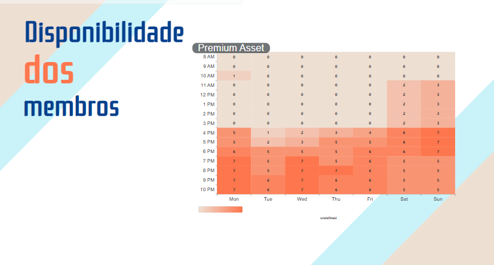

## Heatmap

Um **heatmap**, ou mapa de calor, é uma representação visual de dados que utiliza uma escala de cores para indicar a intensidade de uma variável, como os cliques, movimentos do curso ou tempo de permanência de um utilizador numa página da web, ou no caso do heatmap do grupo, a disponibilidade dos membros para trabalhar em equipe.

## Heatmap da disponibilidade do grupo

Imagem 1: Heatmap do grupo

Fonte: Heyttor Augusto

