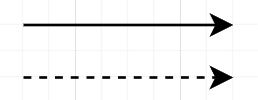

## Introdução

Os casos de usuário usados para descrever um conjunto de ações, de forma detalhada, que um sistema ou um conjunto de sistemas deve desempenhar em colaboração com um ou mais usuários externos ao sistema, fornecendo informações claras dos requisitos funcionais do sistema e em como ele deve ser desenvolvido.

## Metodologia

A metodologia utilizada será utilizada com base no **diagrama dos casos de uso**, servindo como um visualizador simplificado dos detalhes dos usuários de sistema e suas interações com o mesmo, e a **especialização dos casos de uso**, que garante uma melhor compreensão sobre como cada caso de uso está inserido dentro do sistema e suas interações com o usuário.

### *Legenda da Figura 1*

*
 Tabela 1 
*

| Nome | Função | Elemento |
| :----: | :------: | :--------: |
| Sistema (Retângulo) | Define o escopo do sistema para os casos de uso. |  |
| Ator (Boneco Palito) | Representa os que interagem com o sistema, sendo objetos externos que produzam ou consumam dados. |  |
| Caso de uso (Elipse/Oval) | Representa os diferentes usos que alguém pode ter |  |
| Associações (Flecha contínua ou pontilhada) | Ela está entre atores e casos de uso para representar interações ou relações entre ambos. |  |

## Diagrama de Casos de Uso
A figura 1 demonstra o diagrama dos casos de uso.

*
 Figura 1 
*

{.center}

## Especialização dos Casos de Uso

As tabelas de 2 a 6 apresentam as especializações dos casos de uso mostrados no diagrama. As tabelas 2 a 4 são requisitos implementados, as 5 e 6 são requisitos não implementados.

### *
 Tabela 2: Login no app (Implementado) 
*

| UC01 | Informações | Rastreabilidade |
| :--: | :---------: | :-------------: |
| Descrição | O apostante é capaz de logar/entrar no aplicativo. | RF15 |
| Ator | Apostante | - |
| Pré-condições | Acesso à internet, aplicativo e cadastro. | - |
| Ação | O apostante entra na tela de login. | - |
| Fluxo Principal | O apostante acessa o aplicativo; acrescenta seu CPF e senha nas áreas correspondentes; o apostante entra no aplicativo. |  |
| Fluxo Alternativo | O apostante acessa o aplicativo; seus dados são processados automaticamente (devido ao histórico de dados); o apostante entre no aplicativo. |  |
| Fluxo de Execução | O apostante acessa o aplicativo; a seção de login e senha está vazia; ele acrescenta seu cadastro, caso exista, ele é aceito; caso não, não avança para a próxima tela. |  |
| Pós-condições | O apostante tem acesso à página principal do aplicativo. |  |

*
 Fonte: <a href= "https://github.com/TerminaKng05">Samuel Felipe</a> 
*

### *
 Tabela 3: Busca de jogos de aposta (Implementado) 
*

| UC02 | Informações | Rastreabilidade |
| :--: | :---------: | :-------------: |
| Descrição | O apostante é capaz de buscar os jogos de aposta disponíveis. | RF16 |
| Ator | Apostante | - |
| Pré-condições | Acesso à internet, aplicativo e cadastro. | - |
| Ação | O apostante entra na área de busca de jogos. | - |
| Fluxo Principal | O apostante acessa o aplicativo; entra na aba de busca de jogos; seleciona o jogo desejado; |  |
| Fluxo Alternativo | O apostante acessa o aplicativo; entra na aba de busca de jogos; usa o filtro para procurar a categoria desejada; seleciona o jogo desejado; |  |
| Fluxo de Execução | O apostante acessa o aplicativo; a página mostra os jogos disponíveis para apostar. |  |
| Pós-condições | O apostante tem a opção de selecionar o jogo que estava procurando. |  |

*
 Fonte: <a href= "https://github.com/TerminaKng05">Samuel Felipe</a> 
*

### *
 Tabela 4:Pagamento dos jogos (Implementado) 
*

| UC03 | Informações | Rastreabilidade |
| :--: | :---------: | :-------------: |
| Descrição | O apostante é capaz de efetuar o pagamento dos jogos que escolheu. | RF25 |
| Ator | Apostante | - |
| Pré-condições | Acesso à internet, aplicativo, cadastro e conta corrente válida em bancos. | - |
| Ação | O apostante entra na página de pagamento. | - |
| Fluxo Principal | O apostante é direcionado para a página de pagamento; seleciona as opções disponíveis e fornece as informações; efetua o pagamento do jogo ou jogos. |  |
| Fluxo Alternativo | O apostante é direcionado para a página de pagamento; as informações de pagamento estão salvas; efetua o pagamento do jogo ou jogos. |  |
| Fluxo de Execução | A lista de formas de pagamento está vazia; pode adicionar ou alterar forma de pagamento ou mostra que não está disponível. |  |
| Pós-condições | O apostante pode pagar seus jogos. |  |

*
 Fonte: <a href= "https://github.com/TerminaKng05">Samuel Felipe</a> 
*

### *
 Tabela 5: Acompanhar os resultados em tempo real (Não Implementado) 
*

| UC04 | Informações | Rastreabilidade |
| :--: | :---------: | :-------------: |
| Descrição | O apostante consegue acompanhar os resultados dos jogos em tempo real, tanto nos quais apostou e nos quais não apostou. | RNF21 |
| Ator | Apostante | - |
| Pré-condições | Acesso à internet, aplicativo e cadastro. | - |
| Ação | O apostante entra na pagina de resultados | - |
| Fluxo Principal | O apostante acessa a página de resultados; usa o filtro de jogos realizados ou em andamento; visualiza o resultado do jogo que procura. |  |
| Fluxo Alternativo | O apostante acessa a página de resultados; a página mostra os resultados dos jogos; visualiza o resultado do jogo que procura. |  |
| Fluxo de Execução | O apostante acessa a página; é apresentado uma lista de resultados dos jogos em ordem decrescente (mais recentes para mais antigos), ou uma mensagem de "sistema fora do ar". |  |
| Pós-condições | O apostante consegue saber se o seu jogo deu ganho ou não. |  |

*
 Fonte: <a href= "https://github.com/TerminaKng05">Samuel Felipe</a> 
*

### *
 Tabela 6: Ver comprovante dos jogos cadastrados (Não Implementado) 
*

| UC05 | Informações | Rastreabilidade |
| :--: | :---------: | :-------------: |
| Descrição | O apostante consegue ver e baixar o comprovante dos jogos que se cadastrou. | RNF22 |
| Ator | Apostante | - |
| Pré-condições | Acesso à internet, aplicativo, cadastro e acesso ao histórico de pagamento. | - |
| Ação | O apostante entra na área de histórico de jogos. | - |
| Fluxo Principal | O apostante acessa a página de histórico de jogos; é apresentado a opção de visualizar o comprovante; o comprovante é visualizado em pdf. |  |
| Fluxo Alternativo | O apostante acessa a página de histórico de jogos; é apresentado a opção de baixar o comprovante; o comprovante é baixado no sistema em formato de pdf.  |  |
| Fluxo de Execução | O apostante acessa o histórico de jogos; o sistema apresenta o extrato dos jogos pagos com a opção de visualizar ou baixar o comprovante, ou apresenta uma menssagem de "sistema fora do ar". |  |
| Pós-condições | O apostante consegue acessar e baixar os comprovantes dos seus jogos. |  |

*
 Fonte: <a href= "https://github.com/TerminaKng05">Samuel Felipe</a> 
*

## Referências Bibliográficas

- SERRANO, Milene; SERRANO, Maurício. Requisitos - Aula 13. Disponível em: <https://aprender3.unb.br/pluginfile.php/3210637/mod_resource/content/1/Requisitos%20-%20Aula%20013a.pdf>. Acesso em: 11/10/2025.
- Lucidchart. Diagrama de caso de uso UML. disponível em: <https://www.lucidchart.com/pages/pt/diagrama-de-caso-de-uso-uml>. Acesso em: 11/10/2025

## Bibliografia

- SERRANO, Milene; SERRANO, Maurício, Requisitos - Aula 13. Disponível em: <https://aprender3.unb.br/pluginfile.php/3210637/mod_resource/content/1/Requisitos%20-%20Aula%20013a.pdf>. Acesso em: 11/10/2025.
- Lucidchart. Diagrama de caso de uso UML. disponível em: <https://www.lucidchart.com/pages/pt/diagrama-de-caso-de-uso-uml>. Acesso em: 11/10/2025
- Draw.io . Disponível em: <https://www.drawio.com/>. Acesso em: 11/10/2025.

## Versionamento
| Versão | Data | Autor | Descrição | Revisor |
|:------:|:----:|:-----:|:---------:|:-------:|
| ``1.0`` | 11/10/2025 | [Samuel Felipe](https://github.com/TerminaKng05) | Adição inicial das informações e legenda do diagrama. | [Heyttor Augusto](https://github.com/H3ytt0r62) |
| ``1.1`` | 11/10/2025 | [Samuel Felipe](https://github.com/TerminaKng05) | Adição da Introdução, Metodologia, Diagrama de caso de uso, Especialização, Referências Bibliográficas e Bibliografia. Alteração na legenda do diagrama | [Luan Vinícius](https://github.com/luannvi) |
| ``1.2`` | 12/10/2025 | [Samuel Felipe](https://github.com/TerminaKng05) | Adição de informação nas tabelas de especialização dos casos de uso | [Heyttor Augusto](https://github.com/H3ytt0r62) |
| ``1.3``    | 21/10/2025 | [João Pedro](https://github.com/Jadequilin)   | Correção dos IDs de referência à requisitos |[Rivadalvio Joaquim](https://github.com/RivaFilho)  |