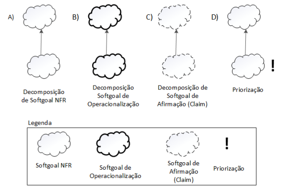
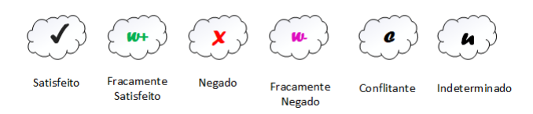
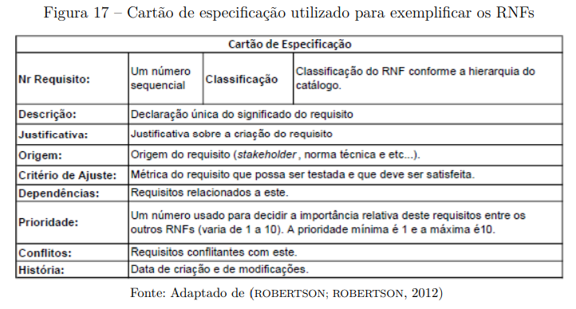
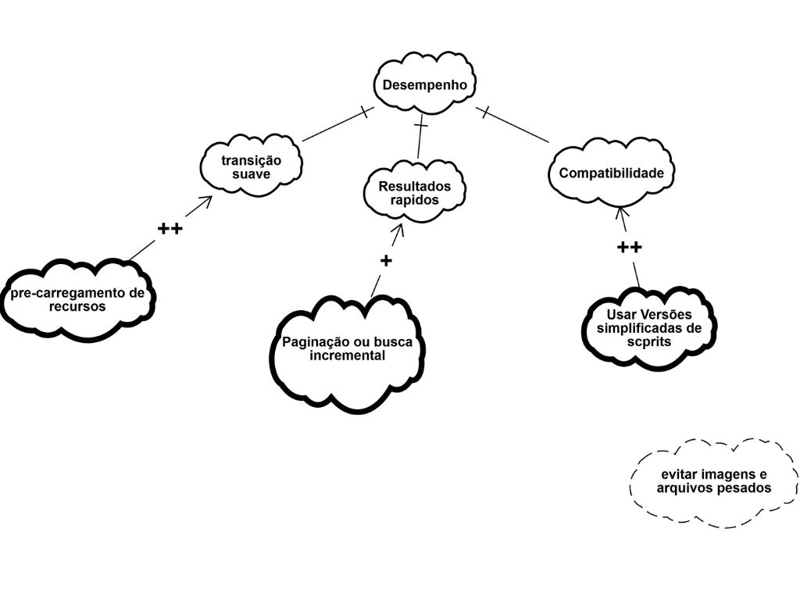
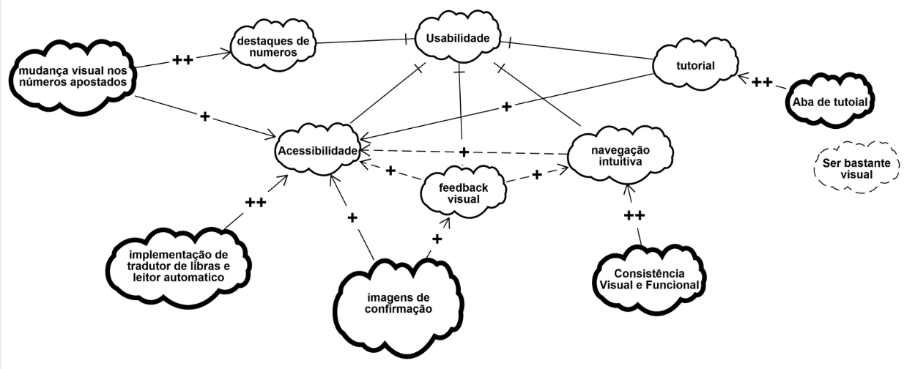
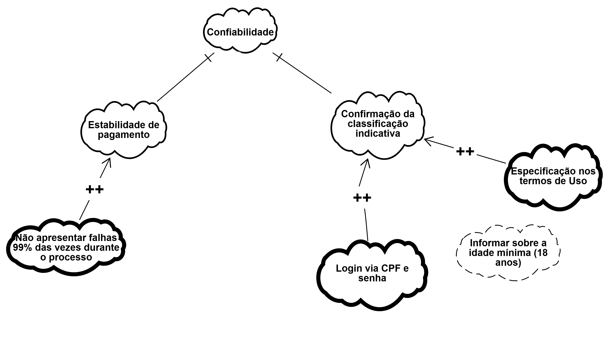

## Introdução 

O NFR Framework é uma abordagem para representar e analisar Requisitos Não-Funcionais.
Seu objetivo é ajudar desenvolvedores na implementação de soluções personalizadas, levando em consideração as características do domínio e do sistema em questão. Tais características incluem Requisitos Não-funcionais, Requisitos funcionais, prioridades e carga de trabalho <a id= "anchor_1" href="#REF1">[1]</a>.

### SIG - Softgoal Interdependency Graph 

O framework pode ser visualizado através do softgoal conhecido como SIG (Softgoal Interdependency Graph), que é um gráfico onde registra as considerações do desenvolvedor sobre os softgoals, mostrando suas interdependências e armazenando de forma gráfica as decisões de desenvolvimento <a id= "anchor_2" href="#REF2">[2]</a>.

O registro gráfico das decisões inclui RNFs (Requisitos Não-funcionais) e suas alternativas, decisões e justificativas associadas às decisões <a id= "anchor_2" href="#REF2">[2]</a>.

### Tipos de Softgoals 

Citado anteriormente, um softgoal é um objetivo que não possui uma clara definição nem critérios de satisfação precisos. E nesse quesito, existem três tipos de softgoals: Softgoals NFR, Softgoals de Operacionalização e Softgoals de Afirmação <a id= "anchor_2" href="#REF2">[2]</a>.

- *Softgoals NFR*: representam os Requisitos Não-Funcionais e podem estar inter-relacionados, em catálogos e mostrados de forma hierárquica; 

*
Figura 1: Softgoal NFR.
*

{.center}

*
 Fonte: (SILVA, 2019)
*

- *Softgoals de Operacionalização*: representam soluções de implementação para
satisfazer softgoals NFR ou outros softgoals de operacionalização;

*
Figura 2: Softgoal de Operacionalização.
*

{.center}

*
 Fonte: (SILVA, 2019)
*

- *Softgoals de Afirmação*: permitem que as características do domínio (como prioridades e carga de trabalho) sejam consideradas e devidamente refletidas no processo
de tomada de decisão. 

*
Figura 3: Softgoal de Afirmação.
*

{.center}

*
 Fonte: (SILVA, 2019)
*

### Interdependências

As interdependências definem as relações entre os softgoals. Os tipos de interdependências
utilizadas pelo framework são os refinamentos e as contribuições <a id= "anchor_3" href="#REF3">[3]</a>.

### Decomposições

As decomposições têm o objetivo de refinar softgoals para obter softgoals mais especializados e estes possam auxiliar na construção do projeto. Os quatro tipos de decomposições
utilizadas pelo NFR Framework são descritos a seguir e apresentados na *figura 4*:

- *Decomposição NFR*: Refina ou subdivide um sofgoal NFR em outros softogals específicos, é util para quebrar problemas grandes em problemas menores <a id= "anchor_3" href="#REF3">[3]</a>;

 

- *Decomposição de Operacionalização*: Refinina ou subdivide um sofgoal de operacionalização em outros do mesmo tipo porém mais específicos, é útil para refinar uma solução geral em soluções mais específicas <a id= "anchor_3" href="#REF3">[3]</a>;

 

- *Decomposição de Afirmação (Claims)*: Refina um softgoal de afirmação em outros de afirmação, é útil para apoiar ou negar justificavas específicas do projeto que está sendo desenvolvido <a id= "anchor_4" href="#REF4">[4]</a>;

 

- *Decomposição de Priorização*: É um tipo especial de decomposição, nela ocorre o refinamento de um softgoal em outro do mesmo tipo e tópicos, porém com uma prioridade associada <a id= "anchor_4" href="#REF4">[4]</a>.

*
Figura 4: Tipos de decomposição.
*

{.center}

*
 Fonte: (SILVA, 2019)
*

### Contribuições

No NFR framework é possível a utilização de diversos tipos de contribuições que
descrevem como a satisfação ou não de um softgoal descendente contribui para a satisfação
do softgoal ascendente. A seguir, os tipos de contribuição utilizadas pelo
framework: <a id= "anchor_5" href="#REF5">[5]</a>

- *AND*: se os softgoals descendentes forem satisfeitos, os softgoals ascendentes serão satisfeitos <a id= "anchor_5" href="#REF5">[5]</a>;
- *OR*: se algum softgoal descendente for satisfeito, o ascendente será satisfeito <a id= "anchor_5" href="#REF5">[5]</a>;
- *MAKE(++)*: fornece uma contribuição positiva entre um softgoal descendente e um softgoal ascendente no qual é concebida no nível mais alto de satisfação, assim, ao utilizar MAKE, se o softgoal descendente for satisfeito o softgoal pai também será <a id= "anchor_5" href="#REF5">[5]</a>;
- *BREAK(--)*: fornece uma contribuição negativa entre um softgoal descendente e um softgoal ascendente no qual é concebida no nível mais alto de negagação, assim, ao utilizar BREAK, se o softgoal descendente for satisfeito o softgoal pai será negado (não satisfeito) <a id= "anchor_5" href="#REF5">[5]</a>; 
- *HELP(+)*: fornece uma contribuição parcialmente positiva entre um softgoal descendente e um softgoal ascendente <a id= "anchor_5" href="#REF5">[5]</a>;
- *HURT(-)*: fornece uma contribuição parcialmente negativa entre um softgoal descendente e um softgoal ascendente <a id= "anchor_5" href="#REF5">[5]</a>;
- *UNKNOWN(?)*: fornece uma contribuição desconhecida entre um softgoal descendente e um softgoal ascendente, podendo ser tanto positiva quanto negativa <a id= "anchor_5" href="#REF5">[5]</a>;
- *EQUALS*: determina que o softgoal descendente só será satisfeito se o softgoal ascendente for satisfeito e que softgoal descendente será negado se o softgoal ascendente for negado <a id= "anchor_5" href="#REF5">[5]</a>;
- *SOME*: é utilizada quando o sinal da contribuição é conhecido, mas a extensão não é <a id= "anchor_5" href="#REF5">[5]</a>.

### Procedimento de avaliação 

Com o procedimento de avaliação, é possível determinar o grau que os requisitos não funcionais (RNFs) são satisfeitos por um conjunto de decisões. Assim, o procedimento determina se cada softgoal ou interdependência do SIG foi suficientemente satisfeito. E para isso, são atribuídos rótulos, que são classificados em: satisfeito, fracamente satisfeito, negado, fracamente negado, conflitante, indeterminado <a id= "anchor_6" href="#REF6">[6]</a>. 

Esses rótulos são ilustrados na Figura 5. 

*
Figura 5: Tipos de Rótulos.
*

{.center}

*
 Fonte: (SILVA, 2019)
*

## Tabela de  contribuições

| Aluno | Descrição | Links|
|-------|-----------|------|
| [Heyttor Augusto](https://github.com/H3ytt0r62) | Criação dos CNFR01, CNFR02 e os diagramas de desempenho e usabilidade  | [CNFR01](#CNFR01), [CNFR02](#CNFR02) |
| [João Pedro](https://github.com/Jadequilin) | Criação dos CNFR03, CNFR04 e os diagramas de compatibilidade e segurança | [CNFR03](#CNFR03), [CNFR04](#CNFR04) |
| [Nayra Nery](https://github.com/NayraNery127) | Criação dos CNFR05 e CNFR06 | [CNFR05](#CNFR05), [CNFR06](#CNFR06) |
| [Miqueias Ezequiel](https://github.com/Kael-web7) | Criação dos CNFR07 e CNFR08 | [CNFR07](#CNFR07), [CNFR08](#CNFR08) |
| [Luan Vinícius](https://github.com/luannvi) | Criação dos CNFR09, CNFR10 e CNFR11 | [CNFR09](#CNFR09), [CNFR10](#CNFR10), [CNFR11](#CNFR11) |
| [Rivadalvio Joaquim](https://github.com/RivaFilho) | Criação dos CNFR12 e CNRF13 | [CNFR12](#CNFR12), [CNFR13](#CNFR13) |
| [Samuel Felipe](https://github.com/TerminaKng05) | Criação do CNFR14 | [CNFR14](#CNFR14) |

## Lista de Requisitos

## Cartões de Especificação

O gerenciamento dos requisitos não-funcionais (RNFs) será padronizado pelo uso do cartão de especificação de Silva (2019, p. 45) <a id= "anchor_7" href="#REF7">[7]</a>, apresentado na Figura 6, visando garantir rigor e consistência. O modelo define que cada RNF seja decomposto em campos claros, como número sequencial, classificação hierárquica, descrição, justificativa, origem, critério de ajuste, dependências, prioridade, conflitos e histórico de alterações. Este método foi escolhido por facilitar diretamente as atividades de rastreabilidade e validação no decorrer do desenvolvimento.

{.center}

*
Figura 6: Modelo do cartão de especificação utilizado.
*

## CNFR01 - O software deve ter telas simples com poucos textos
Autor: [Heyttor Augusto](https://github.com/H3ytt0r62)

| **Campo**              |**Detalhamento**                                                                 |
|-------------------------|----------------------------------------------------------------------------------|
| **Nr Requisito**        | CNFR01                                                                          |
| **Classificação**       | usabilidade                                                               |
| **Descrição**           | O sistema deve ter telas simples com poucos textos |
| **Justificativa**       | Garante  dinamismo, acessibilidade para pessoas com pouca experiência com tecnologia e facilita o entendimento |
| **Origem**              | [RNF01](../../Pós-rastreabilidade/matriz_geral.md)                                                                  |
| **Critério de Ajuste**  | -                          |
| **Dependências**       |-                                                             |
| **Prioridade**          | 6                                                                           |
| **Conflitos**           | —                                                                                |
| **História**            | Criado em 19/10/2025                                                            |

## CNFR02 - A transição de telas durante o fluxo de aposta deve ser fluída e sem travamentos perceptíveis
Autor: [Heyttor Augusto](https://github.com/H3ytt0r62)

| **Campo**              |**Detalhamento**                                                                 |
|-------------------------|----------------------------------------------------------------------------------|
| **Nr Requisito**        | CNFR02                                                                       |
| **Classificação**       | Desempenho                                                                      |
| **Descrição**            |	A transição de telas durante o fluxo de aposta deve ser fluida e sem travamentos perceptíveis|
| **Justificativa**       | Garante  dinamismo e fluidez durante o uso |
| **Origem**              | [RNF08](../../Pós-rastreabilidade/matriz_geral.md)                                                                  |
| **Critério de Ajuste**  | -                          |
| **Dependências**       | [RNF04 O resultado de uma loteria deve ser carregado e exibido na tela em menos de 3 segundos sob uma conexão 4G/5G](../../Pós-rastreabilidade/matriz_geral.md)                                                         |
| **Prioridade**          | 7                                                                  |
| **Conflitos**           | —                                                                                |
| **História**            | Criado em 19/10/2025                                                            |

### Validação - CNFR01 e CNFR02

Foram realizadas no dia 20/10/2025 pelo estudante Heyttor Augusto e o usuário Marcio Junio.

<iframe width="560" height="315" src="https://www.youtube.com/embed/z9bhFri5GDw?si=J6dpVoajbVbWzEEp" title="YouTube video player" frameborder="0" allow="accelerometer; autoplay; clipboard-write; encrypted-media; gyroscope; picture-in-picture; web-share" referrerpolicy="strict-origin-when-cross-origin" allowfullscreen></iframe>

## CNFR03 - Acessibilidade para Idosos e PCDs
Autor: [João Pedro](https://github.com/Jadequilin)

| **Campo**              | **Detalhamento** |
|-------------------------|------------------|
| **Nr Requisito**        | NFR01 |
| **Classificação**       | Usabilidade/Acessibilidade |
| **Descrição**           | O sistema deve ser acessível para idosos e pessoas com deficiência visual, com texto aumentável, alto contraste e compatibilidade com leitores de tela. |
| **Justificativa**       | Inclusão digital e conformidade com leis de acessibilidade; atendimento a usuários com baixa visão ou limitações motoras. |
| **Origem**              | [RF33](../../Pós-rastreabilidade/matriz_geral.md) |
| **Critério de Ajuste**  | - Texto aumentável em 200% - Contraste mínimo 7:1 - Compatível com VoiceOver/TalkBack - Navegação por voz funcional |
| **Dependências**        | [RNF11](../../Pós-rastreabilidade/matriz_geral.md) |
| **Prioridade**          | 6 |
| **Conflitos**           | [RNF01](../../Pós-rastreabilidade/matriz_geral.md) - Telas simples podem limitar opções de acessibilidade |
| **História**            | Criado em 19/10/2025 |

## CNFR04 - Performance em Dispositivos Antigos
Autor: [João Pedro](https://github.com/Jadequilin)

| **Campo**              | **Detalhamento** |
|-------------------------|------------------|
| **Nr Requisito**        | NFR02 |
| **Classificação**       | Desempenho |
| **Descrição**           | O sistema deve funcionar adequadamente em dispositivos Android/iOS com mais de 3 anos, mesmo com hardware limitado e conexões instáveis. |
| **Justificativa**       | Grande parcela de usuários possui dispositivos antigos; performance ruim leva ao abandono do aplicativo. |
| **Origem**              | [RNF22](../../Pós-rastreabilidade/matriz_geral.md), [RNF23](../../Pós-rastreabilidade/matriz_geral.md) |
| **Critério de Ajuste**  | - Funcionamento em Android 8+ e iOS 12+ - Uso de RAM ≤150MB - Carregamento ≤5s em 3G - Estável com 3% de perda de pacotes |
| **Dependências**        | [RNF04](../../Pós-rastreabilidade/matriz_geral.md), [RNF08](../../Pós-rastreabilidade/matriz_geral.md) |
| **Prioridade**          | 7 |
| **Conflitos**           | [RNF06](../../Pós-rastreabilidade/matriz_geral.md) - Interface rica pode impactar performance |
| **História**            | Criado em 19/10/2025 |

### Validação com o Usuário (NRFs - CNFR03 e CNFR04)

<iframe width="560" height="315" src="https://www.youtube.com/embed/WP7E8oXh720?si=ef1Ug30KbpipVnlK" title="YouTube video player" frameborder="0" allow="accelerometer; autoplay; clipboard-write; encrypted-media; gyroscope; picture-in-picture; web-share" referrerpolicy="strict-origin-when-cross-origin" allowfullscreen></iframe>

| Participante | Função | Data | Horário | Local | 
| ------------ | ----- | ----- | ------ | -------|
| [João Pedro](https://github.com/Jadequilin) | Integrante do grupo, responsável por coordenar a validação com o usuário. | 20/10/2025 | 20:20 | Presencial, residência
| Janice José Araújo | 49 anos, funcionária pública e usuária do app Loterias Caixa, responsável por validar as NRFs desenvolvidas para o artefato. | 20/10/2025 | 20:20 | Presencial, residência |

## CNFR05 - Feedback Visual Imediato ao Adicionar Aposta
Autor: [Nayra Nery](https://github.com/NayraNery127)

| **Campo**              | **Detalhamento** |
|-------------------------|------------------|
| **Nr Requisito**        | NFR05 |
| **Classificação**       | Usabilidade |
| **Descrição**           |O sistema deve exibir feedback visual em até 1 segundo, destacando o carrinho e mostrando uma confirmação na tela sempre que o usuário adicionar uma aposta. |
| **Justificativa**       | Garante que o usuário perceba claramente que sua ação foi realizada com sucesso, evitando confusão e múltiplos cliques. Melhora a experiência e a confiança na interação com o sistema. |
| **Origem**              | [RNF09](../../Pós-rastreabilidade/matriz_geral.md) |
| **Critério de Ajuste**  | - Exibir confirmação visual em até 1 segundo após adicionar a aposta - Feedback deve permanecer visível por pelo menos 2 segundos - Mensagem ou ícone deve ser compreensível e não intrusivo |
| **Dependências**        | [RNF03](../../Pós-rastreabilidade/matriz_geral.md), [RNF08](../../Pós-rastreabilidade/matriz_geral.md) |
| **Prioridade**          | 6 |
| **Conflitos**           | [RNF06](../../Pós-rastreabilidade/matriz_geral.md) - Feedback sonoro pode ser redundante ou distrativo |
| **História**            | Criado em 20/10/2025 |

## CNFR06 - Expiração Automática de Sessão por Inatividade
Autor: [Nayra Nery](https://github.com/NayraNery127)

| **Campo**              | **Detalhamento** |
|-------------------------|------------------|
| **Nr Requisito**        | NFR06 |
| **Classificação**       | Segurança |
| **Descrição**           | A sessão do usuário deve expirar automaticamente após 15 minutos de inatividade, exigindo novo login para continuar o uso do aplicativo. |
| **Justificativa**       | Protege informações pessoais e financeiras do usuário em caso de esquecimento do aplicativo aberto, evitando acessos indevidos. |
| **Origem**              | [RNF10](../../Pós-rastreabilidade/matriz_geral.md) |
| **Critério de Ajuste**  | - Encerrar sessão após 15±1 minutos sem interação - Exibir mensagem de aviso antes da expiração - Redirecionar automaticamente para a tela de login |
| **Dependências**        | [RNF05](../../Pós-rastreabilidade/matriz_geral.md) |
| **Prioridade**          | 8 |
| **Conflitos**           | [RNF03](../../Pós-rastreabilidade/matriz_geral.md) - Persistência de dados temporários pode impedir o encerramento completo da sessão |
| **História**            | Criado em 20/10/2025 |

### Validação - CNFR05 e CNFR06

<iframe width="560" height="315" src="https://www.youtube.com/embed/QHLd4eErvhE?si=v6Bblky58GTNyJUO" title="YouTube video player" frameborder="0" allow="accelerometer; autoplay; clipboard-write; encrypted-media; gyroscope; picture-in-picture; web-share" referrerpolicy="strict-origin-when-cross-origin" allowfullscreen></iframe>

## CNFR07 - Navegação Intuitiva e Fluidez da Experiência
Autor: [Miqueias Ezequiel](https://github.com/Kael-web7)

| **Campo** | **Detalhamento** |
| --- | --- |
| **Nr Requisito** | NFR03 |
| **Classificação** | Usabilidade |
| **Descrição** | A navegação entre a seleção de jogos, o preenchimento do volante e o carrinho de compras deve ser intuitiva, permitindo que o usuário conclua o processo em no máximo 3 toques. |
| **Justificativa** | Uma navegação simplificada aumenta a eficiência da interação e reduz erros do usuário, resultando em uma melhor experiência e maior engajamento com o aplicativo. |
| **Origem** | RNF03 |
| **Critério de Ajuste** | - No máximo 3 toques para completar o fluxo de aposta - Transição entre telas ≤ 1,5s - Interface responsiva e consistente entre dispositivos |
| **Dependências** | - |
| **Prioridade** | 7 |
| **Conflitos** | - |
| **História** | Criado em 20/10/2025 |

## CNFR08 - Desempenho e Agilidade na Exibição de Resultados
Autor: [Miqueias Ezequiel](https://github.com/Kael-web7)

| **Campo** | **Detalhamento** |
| --- | --- |
| **Nr Requisito** | NFR04 |
| **Classificação** | Desempenho |
| **Descrição** | O aplicativo deve carregar e exibir o resultado de uma loteria em menos de 3 segundos sob uma conexão móvel 4G ou 5G padrão. |
| **Justificativa** | O tempo de carregamento afeta diretamente a percepção de qualidade e confiabilidade. Resultados lentos reduzem o engajamento e podem impactar negativamente a reputação do aplicativo. |
| **Origem** | RNF04 |
| **Critério de Ajuste** | - Tempo de carregamento ≤ 3s em 4G/5G - Utilização de cache para resultados recentes - Estável com até 3% de perda de pacotes |
| **Dependências** | - |
| **Prioridade** | 8 |
| **Conflitos** | - |
| **História** | Criado em 20/10/2025 |

### Validação backlog CNFR07 - CNFR08
Foram realizadas no dia 20/10/2025 pelo estudante Miqueias Ezequiel e o usuario Matheus Queiroz

<iframe width="560" height="315" src="https://www.youtube.com/embed/a4QEKQaxpt4?si=esB6q7Fjq95I7gD9" title="YouTube video player" frameborder="0" allow="accelerometer; autoplay; clipboard-write; encrypted-media; gyroscope; picture-in-picture; web-share" referrerpolicy="strict-origin-when-cross-origin" allowfullscreen></iframe>

## CNFR09 – Diferenciação visual dos números selecionados
Autor: [Luan Vinícius](https://github.com/luannvi)

| Campo | Detalhamento |
|:---|:---|
| **Nr Requisito** | CNFR09 |
| **Classificação** | Usabilidade |
| **Descrição** | Os números selecionados no volante digital devem ser claramente diferenciados dos não selecionados, através de cor e contraste. |
| **Justificativa** | Melhorar a clareza visual e reduzir erros de seleção durante a escolha dos números da aposta. |
| **Origem** | [RNF06](../../Pós-rastreabilidade/matriz_geral.md) |
| **Critério de Ajuste** | Pelo menos 95% dos usuários devem ser capazes de identificar corretamente os números selecionados durante testes de usabilidade. |
| **Dependências** | [RF17](../../Pós-rastreabilidade/matriz_geral.md), [RF18](../../Pós-rastreabilidade/matriz_geral.md) |
| **Prioridade** | 8 |
| **Conflitos** | Nenhum identificado |
| **História** | Criado em 21/10/2025 |

## CNFR10 – Estabilidade durante criação e pagamento de apostas
Autor: [Luan Vinícius](https://github.com/luannvi)

| Campo | Detalhamento |
|:---|:---|
| **Nr Requisito** | CNFR10 |
| **Classificação** | Confiabilidade |
| **Descrição** | O aplicativo não deve apresentar erros ou fechar inesperadamente durante o processo de criação e pagamento de uma aposta. |
| **Justificativa** | Garantir a continuidade das operações e a confiança do usuário em processos financeiros críticos. |
| **Origem** | [RNF07](../../Pós-rastreabilidade/matriz_geral.md) |
| **Critério de Ajuste** | O sistema não deve apresentar falhas ou travamentos em 99% dos testes de criação e pagamento de apostas. |
| **Dependências** | [RF17](../../Pós-rastreabilidade/matriz_geral.md), [RF22](../../Pós-rastreabilidade/matriz_geral.md), [RF24](../../Pós-rastreabilidade/matriz_geral.md) |
| **Prioridade** | 10 |
| **Conflitos** | Nenhum identificado |
| **História** | Criado em 21/10/2025 |

## CNFR11 – Interface autoexplicativa e acessível
Autor: [Luan Vinícius](https://github.com/luannvi)

| Campo | Detalhamento |
|:---|:---|
| **Nr Requisito** | CNFR11 |
| **Classificação** | Usabilidade |
| **Descrição** | O sistema deve garantir que o acesso a funcionalidades primárias seja feito através de componentes de interface autoexplicativos. Ícones de navegação, como o menu principal, devem ser acompanhados por um rótulo textual (ex: “Menu”). |
| **Justificativa** | Facilitar o uso do aplicativo, especialmente para novos usuários e pessoas com pouca familiaridade tecnológica. |
| **Origem** | [RNF11](../../Pós-rastreabilidade/matriz_geral.md) |
| **Critério de Ajuste** | Todos os ícones principais devem possuir um rótulo textual visível. Testes de usabilidade devem indicar 90% de sucesso em encontrar funções básicas. |
| **Dependências** | [RF13](../../Pós-rastreabilidade/matriz_geral.md), [RF30](../../Pós-rastreabilidade/matriz_geral.md) |
| **Prioridade** | 8 |
| **Conflitos** | Nenhum identificado |
| **História** | Criado em 21/10/2025 |

### Validação com o Usuário (CNFR 09 - 11)

<iframe width="560" height="315" src="https://www.youtube.com/embed/rCJIxTbGOzM?si=UQMXFNZvqPWQaNtH" title="YouTube video player" frameborder="0" allow="accelerometer; autoplay; clipboard-write; encrypted-media; gyroscope; picture-in-picture; web-share" referrerpolicy="strict-origin-when-cross-origin" allowfullscreen></iframe>

| Participante | Função | Data | Horário | Local |
| ------------ | ----- | ----- | ------ | -------|
| [Luan Vinícius](https://github.com/luannvi) | Integrante do grupo, responsável por coordenar a validação com o usuário. | 21/10/2025 | 16:30 | Presencial
| Matheus Queiroz | Estudante de engenharia de software e usuário do app Loterias Caixa, responsável por validar os cartões desenvolvidos. | 21/10/2025 | 16:30 | Presencial |

## CNRF12 - Compatibilidade Multiplataforma
Autor: [Rivadalvio Joaquim](https://github.com/RivaFilho)

| **Campo**              | **Detalhamento** |
|-------------------------|------------------|
| **Nr Requisito**        | NFR12 |
| **Classificação**       | Compatibilidade |
| **Descrição**           | O sistema deve funcionar de forma consistente e com a mesma qualidade em dispositivos Android e iOS, mantendo todas as funcionalidades principais em ambas as plataformas. |
| **Justificativa**       | Garantir que todos os usuários, independente do sistema operacional, tenham acesso às mesmas funcionalidades e qualidade de experiência, ampliando o alcance do aplicativo. |
| **Origem**              | [RNF12](../../Pós-rastreabilidade/matriz_geral.md) |
| **Critério de Ajuste**  | - Funcionalidades idênticas em Android e iOS - Interface adaptada às diretrizes de cada plataforma - Atualizações lançadas simultaneamente - Performance similar em dispositivos equivalentes |
| **Dependências**        | [RNF11](../../Pós-rastreabilidade/matriz_geral.md), [RNF12](../../Pós-rastreabilidade/matriz_geral.md) |
| **Prioridade**          | 7 |
| **Conflitos**           | [RNF02](../../Pós-rastreabilidade/matriz_geral.md) - Recursos específicos de plataforma podem limitar a uniformidade |
| **História**            | Criado em 20/10/2025 |

## CNRF13 - Tutorial Interativo e Onboarding
Autor: [Rivadalvio Joaquim](https://github.com/RivaFilho)

| **Campo**              | **Detalhamento** |
|-------------------------|------------------|
| **Nr Requisito**        | NFR13 |
| **Classificação**       | Usabilidade |
| **Descrição**           | O sistema deve oferecer um tutorial interativo para novos usuários, explicando as funcionalidades principais de forma clara e objetiva, com opção de pular e revisitar posteriormente. |
| **Justificativa**       | Reduz a curva de aprendizado para novos usuários, aumenta a retenção e garante que todas as funcionalidades sejam conhecidas e utilizadas adequadamente. |
| **Origem**              | [RNF30](../../Pós-rastreabilidade/matriz_geral.md) |
| **Critério de Ajuste**  | - Tutorial exibido na primeira execução - Cobertura de pelo menos 80% das funcionalidades principais - Duração máxima de 3 minutos - Opção de pular e acessar depois via menu de ajuda |
| **Dependências**        | [RNF03](../../Pós-rastreabilidade/matriz_geral.md), [RNF01](../../Pós-rastreabilidade/matriz_geral.md) |
| **Prioridade**          | 5 |
| **Conflitos**           | [RNF08](../../Pós-rastreabilidade/matriz_geral.md) - Conteúdo adicional pode impactar performance inicial |
| **História**            | Criado em 20/10/2025 |

## CNFR14 - O sistema deve especificar a classificação indicativa
Autor: [Samuel Felipe](https://github.com/TerminaKng05)

| **Campo**              |**Detalhamento**                                                                 |
|-------------------------|----------------------------------------------------------------------------------|
| **Nr Requisito** | CNFR14 |
| **Classificação** | Confiabilidade |
| **Descrição** | O sistema deve especificar a classificação indicativa de uso em seus termos de uso e ao utilizá-lo; |
| **Justificativa** | Garantir que os usuários do sistema são o público alvo e que a lei permite; |
| **Origem** | [RNF15](../../Pós-rastreabilidade/matriz_geral.md) |
| **Critério de Ajuste**  | - Notificação de término da sessão por inatividade. |
| **Dependências**       |- [RF30](../../Pós-rastreabilidade/matriz_geral.md), [RF12](../../Pós-rastreabilidade/matriz_geral.md), [RF14](../../Pós-rastreabilidade/matriz_geral.md) |
| **Prioridade**          | 10 |
| **Conflitos**           | — |
| **História** | Criado em 21/10/2025 |

## Graficos NFR 

## NFR Desempenho 
Os requisitos abordados neste diagrama de NFR Foram: 

- [CNFR02](#CNFR02)
- [CNFR08](#CNFR08)
- [CNFR04](#CNFR04)

*
Figura 7: Diagrama de Desempenho.
*

*
Autor: [Heyttor Augusto](https://github.com/H3ytt0r62) 
*

## NFR Usabilidade
Os requisitos abordados neste diagrama de NFR Foram: 

- [CNFR01](#CNFR01)
- [CNFR03](#CNFR03)
- [CNFR05](#CNFR05)
- [CNFR07](#CNFR07)
- [CNFR09](#CNFR09)
- [CNFR11](#CNFR11)
- [CNFR13](#CNFR13)

*
Figura 8: Diagrama de Usabilidade.
*

*
Autor: [Heyttor Augusto](https://github.com/H3ytt0r62) 
*

## NFR Compatibilidade
O requisito abordado nesse diagrama NFR foi:

- [CNFR12](#cnrf12---compatibilidade-multiplataforma)

*
Figura 9: Diagrama de Compatibilidade.
*

*
Autor: [João Pedro](https://github.com/Jadequilin) 
*

## NFR Segurança
O requisito abordado nesse diagrama NFR foi:

-[CNFR06](#cnfr06---expiração-automática-de-sessão-por-inatividade)

*
Figura 10: Diagrama de Segurança.
*

*
Autor: [João Pedro](https://github.com/Jadequilin) 
*

## NFR Confiabilidade
O requisito abordado nesse diagrama NFR foi:

- [CNFR10](#cnfr10--estabilidade-durante-criação-e-pagamento-de-apostas)
- [CNFR14](#cnfr14---o-sistema-deve-expirar-a-sessão-do-usuário-após-15-minutos-de-inatividade)

*
Figura 11: Diagrama de Confiabilidade.
*

*
Autor: [Samuel Felipe](https://github.com/TerminaKng05) 
*

## Agradecimentos 

O grupo 7 agradece o apoio das ferramentas de inteligencia artificial generativa - **chatGPT**, **Google Gemini** - na revisão gramatical e estilo de algumas partes do texto. As tecnologias foram utilzizadas para organizar e deixar o texto mais claro, alem de que fornecer alguns exemplos de codigos de mkdocs para servir de referencia para os autores. Todo o conteudo, assim como a precisão técnica e as ideias apresentadas, permanecem de responsabilidade dos autores.

## Referência Bibliográfica

> <a id="REF1" href="#anchor_1">1.</a> SILVA, Reinaldo Antônio da. NFR4ES: um Catálogo de Requisitos Não-Funcionais para Sistemas Embarcados. 2019. Tese (Doutorado) – Universidade Federal de Pernambuco, Recife, 2019. Cap. 2 p. 30. Disponível em: <https://aprender3.unb.br/pluginfile.php/3210672/mod_resource/content/2/DISSERTA%C3%87%C3%83O%20Reinaldo%20Ant%C3%B4nio%20da%20Silva.pdf>. Acesso em: 20 out. 2025.

> <a id="REF2" href="#anchor_2">2.</a> SILVA, Reinaldo Antônio da. NFR4ES: um Catálogo de Requisitos Não-Funcionais para Sistemas Embarcados. 2019. Tese (Doutorado) – Universidade Federal de Pernambuco, Recife, 2019. Cap. 2 p. 31. Disponível em: <https://aprender3.unb.br/pluginfile.php/3210672/mod_resource/content/2/DISSERTA%C3%87%C3%83O%20Reinaldo%20Ant%C3%B4nio%20da%20Silva.pdf>. Acesso em: 20 out. 2025.

> <a id="REF3" href="#anchor_3">3.</a> SILVA, Reinaldo Antônio da. NFR4ES: um Catálogo de Requisitos Não-Funcionais para Sistemas Embarcados. 2019. Tese (Doutorado) – Universidade Federal de Pernambuco, Recife, 2019. Cap. 2 p. 32. Disponível em: <https://aprender3.unb.br/pluginfile.php/3210672/mod_resource/content/2/DISSERTA%C3%87%C3%83O%20Reinaldo%20Ant%C3%B4nio%20da%20Silva.pdf>. Acesso em: 20 out. 2025.

> <a id="REF4" href="#anchor_4">4.</a> SILVA, Reinaldo Antônio da. NFR4ES: um Catálogo de Requisitos Não-Funcionais para Sistemas Embarcados. 2019. Tese (Doutorado) – Universidade Federal de Pernambuco, Recife, 2019. Cap. 2 p. 33. Disponível em: <https://aprender3.unb.br/pluginfile.php/3210672/mod_resource/content/2/DISSERTA%C3%87%C3%83O%20Reinaldo%20Ant%C3%B4nio%20da%20Silva.pdf>. Acesso em: 20 out. 2025.

> <a id="REF5" href="#anchor_5">5.</a> SILVA, Reinaldo Antônio da. NFR4ES: um Catálogo de Requisitos Não-Funcionais para Sistemas Embarcados. 2019. Tese (Doutorado) – Universidade Federal de Pernambuco, Recife, 2019. Cap. 2 p. 33 - 35. Disponível em: <https://aprender3.unb.br/pluginfile.php/3210672/mod_resource/content/2/DISSERTA%C3%87%C3%83O%20Reinaldo%20Ant%C3%B4nio%20da%20Silva.pdf>. Acesso em: 20 out. 2025.

> <a id="REF6" href="#anchor_6">6.</a> SILVA, Reinaldo Antônio da. NFR4ES: um Catálogo de Requisitos Não-Funcionais para Sistemas Embarcados. 2019. Tese (Doutorado) – Universidade Federal de Pernambuco, Recife, 2019. Cap. 2 p. 38. Disponível em: <https://aprender3.unb.br/pluginfile.php/3210672/mod_resource/content/2/DISSERTA%C3%87%C3%83O%20Reinaldo%20Ant%C3%B4nio%20da%20Silva.pdf>. Acesso em: 20 out. 2025.

> <a id="REF7" href="#anchor_7">7.</a> SILVA, Reinaldo Antônio da. NFR4ES: um Catálogo de Requisitos Não-Funcionais para Sistemas Embarcados. 2019. Tese (Doutorado) – Universidade Federal de Pernambuco, Recife, 2019. Cap. 2 p. 45. Disponível em: <https://aprender3.unb.br/pluginfile.php/3210672/mod_resource/content/2/DISSERTA%C3%87%C3%83O%20Reinaldo%20Ant%C3%B4nio%20da%20Silva.pdf>. Acesso em: 20 out. 2025.

## Versionamento

| Versão | Data       | Autor               | Descrição                                    | Revisor |
|:--------:|:------------:|:---------------------:|:----------------------------------------------:|:---------:|
| ``1.0``    | 19/10/2025 | [Heyttor Augusto](https://github.com/H3ytt0r62)   | Criação da NFR e adição de alguns| [Samuel Felipe](https://github.com/TerminaKng05) |
| ``1.1`` | 19/10/2025 | [João Pedro](https://github.com/Jadequilin) | Criação das CNFR's 3 e 4 | [Rivadalvio Joaquim](https://github.com/RivaFilho) |
| ``1.2`` | 20/10/2025 | [Nayra Nery](https://github.com/NayraNery127) | Criação das CNFR's 5 e 6 | [Samuel Felipe](https://github.com/TerminaKng05) |
| ``1.3`` | 20/10/2025 | [João Pedro](https://github.com/Jadequilin) | Validação das CNFR's 3 e 4 | [Rivadalvio Joaquim](https://github.com/RivaFilho) |
| ``1.4`` | 20/10/2025 | [Miqueias Ezequiel](https://github.com/Kael-web7) | Validação das CNFR's 7 e 8 | [Luan Vinícius](https://github.com/luannvi) |
| ``1.5`` | 21/10/2025 | [Luan Vinícius](https://github.com/luannvi) | Criação das CNFR's 9, 10 e 11, adição da introdução, ref. bibliográficas e do modelo de cartão de esp., correção das âncoras | [Miqueias Ezequiel](https://github.com/Kael-web7) |
| ``1.6`` | 21/10/2025 | [Rivadalvio Joaquim](https://github.com/RivaFilho) | Criação das CNRF's 12 e 13 | [João Pedro](https://github.com/Jadequilin) |
| ``1.7`` | 21/10/2025 |[Heyttor Augusto](https://github.com/H3ytt0r62)   | Criação dos diagramas de desempenho e usabilidade | [Samuel Felipe](https://github.com/TerminaKng05) |
| ``1.8`` | 21/10/2025 | [João Pedro](https://github.com/Jadequilin) | Criação dos diagramas de segurança e compatibilidade,  Correção dos IDs de referência à requisitos  | [Rivadalvio Joaquim](https://github.com/RivaFilho) |
| ``1.9`` | 21/10/2025 | [Luan Vinícius](https://github.com/luannvi) | Adição da validação com o usuário (CNFR 09 - 11) | [Miqueias Ezequiel](https://github.com/Kael-web7) |
| ``2.0`` | 21/10/2025 | [Samuel Felipe](https://github.com/TerminaKng05) | Criação da CNFR 14 e do diagrama de confiabilidade | [Heyttor Augusto](https://github.com/H3ytt0r62)
| ``2.1`` | 21/10/2025 | [Miqueias Ezequiel](https://github.com/Kael-web7) | adição link CNFR's 7-8  | [Luan Vinícius](https://github.com/luannvi) |
| ``2.2``     | 20/11/2025 | [Miquéias Ezequiel](https://github.com/Kael-web7)    | Especificação aprimorada RNF09 | [Luan Vinícius](https://github.com/luannvi) |