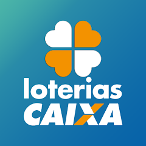

# Ferramentas 

## Introdução 

Os softwares escolhidos servirão como ferramentas de apoio para a equipe do projeto, auxiliando no gerenciamento, na comunicação e na elaboração da documentação necessária para o tema abordado na disciplina, cujo foco será a análise de requisitos do aplicativo Loterias Caixa.

## Ferramentas utilizadas 

Tabela 1: Ferramentas utilizadas no projeto

| Logo | Ferramenta       | Finalidade |
|------|-----------------|------------|
|        | **GitHub** | Plataforma de hospedagem de código baseada em Git. Utilizada para versionamento, armazenamento de projetos em repositórios, revisão de código e gerenciamento de problemas. |
|     | **Git Pages** | Serviço de hospedagem estática integrado ao GitHub. Permite publicar sites diretamente de um repositório, transformando código em uma página web acessível publicamente. |
|  | **Loterias Caixa** | É o aplicativo oficial da Caixa Econômica Federal que permite realizar apostas, acompanhar resultados e conferir bilhetes premiados das principais loterias do Brasil, oferecendo praticidade, segurança e acesso facilitado aos sorteios. |
|          | **Docs** | Refere-se ao serviço de documentação e edição de texto colaborativo em tempo real. Usado para criar manuais, relatórios e planejamentos compartilhados. |
|       | **Discord** | Aplicativo de comunicação voltado originalmente para comunidades de jogos, mas amplamente adotado por outros grupos. Atualmente, serve como plataforma de encontro secundária do projeto. Oferece salas de voz, vídeo chamadas e chat de texto em servidores organizados por canais, além do acesso ser muito facilitado. |
|    | **OBS Studio** | Utilizado para realizar as gravações das reuniões do grupo. |
|      | **WhatsApp** | Software de comunicação ágil escolhido para troca de informações e salvamento de informações sobre o andamento do projeto. |
|      | **FIGMA** | Ferramenta de design colaborativo baseada em nuvem. Utilizada para criar interfaces, protótipos interativos e fluxos de navegação. |

## Referências das Ferramentas Utilizadas

- **GitHub**. Disponível em: <https://github.com/>
- **GitHub Pages**. Disponível em: <https://pages.github.com/>
- **Loterias Caixa**.  
  Disponível em:  
  • <https://www.loteriasonline.caixa.gov.br/>  
  • <https://play.google.com/store/search?q=loterias%20caixa&c=apps>  
  (Aplicativo oficial disponível nas lojas Google Play e App Store.)
- **Google Docs**. Disponível em: <https://docs.google.com/>
- **Discord**. Disponível em: <https://discord.com/>
- **OBS Studio**. Disponível em: <https://obsproject.com/>
- **WhatsApp**. Disponível em: <https://www.whatsapp.com/>

## Versionamento 

| Versão | Data       | Autor               | Descrição                                    | Revisor |
|:--------:|:------------:|:---------------------:|:----------------------------------------------:|:---------:|
| ``1.0``    | 09/09/2025 | [João Pedro](https://github.com/Jadequilin)   | Adição das ferramentas do projeto | [Luan Vinícius](https://github.com/luannvi) |
| ``2.0``     | 08/11/2025 | [Miquéias Ezequiel](https://github.com/Kael-web7) | Adição da referência das ferramentas | [Luan Vinícius](https://github.com/luannvi) |
