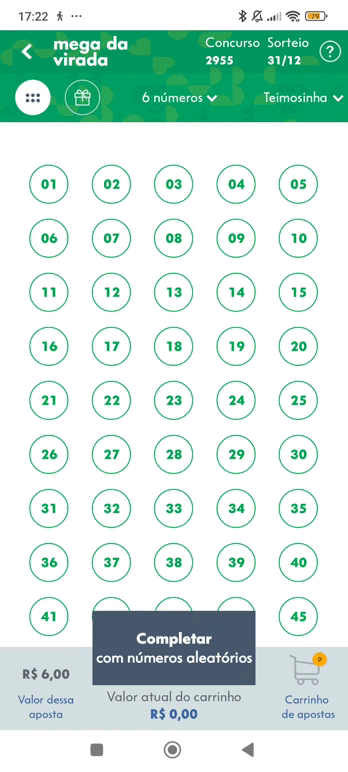
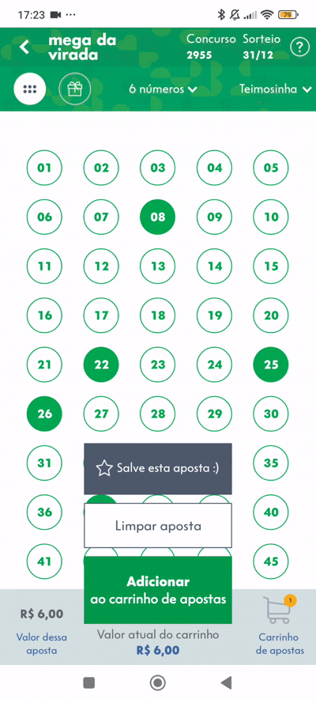
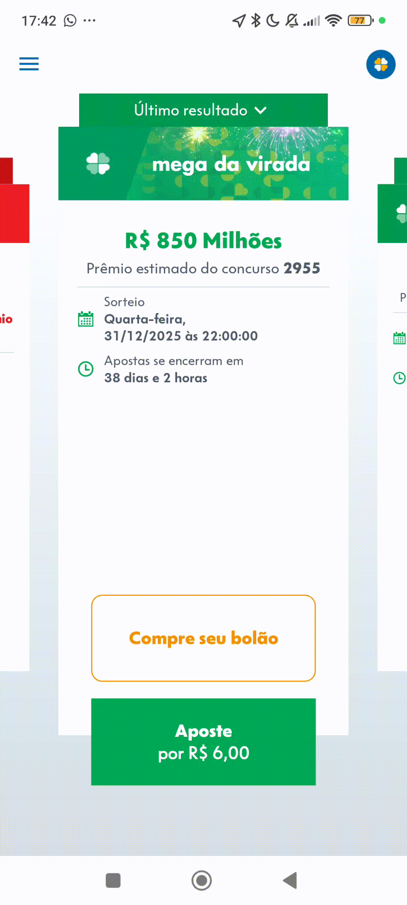

## Introdução
O Modelo de Toranzo organiza a rastreabilidade de requisitos de software ao longo de todo o ciclo de vida do sistema, permitindo identificar as relações entre artefatos como requisitos, código, casos de uso e testes. Ele utiliza diferentes tipos de elos — satisfação, recurso, representação, alocação e agregação — para garantir a rastreabilidade bidirecional (forward e backward), possibilitando acompanhar a implementação, verificar impactos de mudanças e assegurar a consistência entre os artefatos do projeto.

## RF01 O usuário deve receber Comprovantes de seus ganhos e apostas

| **RF01**  | Classificação do Artefato Analisado |
| --- | --- |
| Tipos de Elo | Artefatos Relacionados |
| Satisfação | - |
| Recurso | - |
| Representação | - |
| Alocado | - |
| Agregação | -|

##  RF02  O usuário deve ter mais de uma opção de aposta

| **RF02**  | Classificação do Artefato Analisado |
| --- | --- |
| Tipos de Elo | Artefatos Relacionados |
| Satisfação | - |
| Recurso | [CN03](../Modelagem/Cenários.md)|
| Representação |   |
| Alocado | - |
| Agregação | -|

## RF03  O usuário deve poder acompanhar jogos pelo software

| **RF03**  | Classificação do Artefato Analisado |
| --- | --- |
| Tipos de Elo | Artefatos Relacionados |
| Satisfação | - |
| Recurso | -|
| Representação |  |
| Alocado | - |
| Agregação | -|

## RF04 O software deve ter poucas telas 

| **RF04**  | Classificação do Artefato Analisado |
| --- | --- |
| Tipos de Elo | Artefatos Relacionados |
| Satisfação | - |
| Recurso | -|
| Representação | - |
| Alocado | - |
| Agregação | -|

## RF05 O usuário deve poder consultar seus ganhos

| **RF05**  | O usuário deve poder consultar seus ganhos |
| --- | --- |
| Tipos de Elo | Artefatos Relacionados |
| Satisfação | - |
| Recurso | -|
| Representação | |
| Alocado | - |
| Agregação | -|

## RF06 O software deve ter opções de modo escuro e claro

| **RF06**  | Classificação do Artefato Analisado |
| --- | --- |
| Tipos de Elo | Artefatos Relacionados |
| Satisfação | [suportabilidade](../Modelagem/Especificação%20Suplementar.md) |
| Recurso | -|
| Representação |  |
| Alocado | - |
| Agregação |  [HU01](../Modelagem/Ágil/História%20de%20usuário.md) |

## RF07 O usuário deve receber o resultado das apostas

| **RF07** | Classificação do Artefato Analisado |
| --- | --- |
| Tipos de Elo | -|
| Satisfação | - |
| Recurso |- |
| Representação |  |
| Alocado | - |
| Agregação | [HU03](../Modelagem/Ágil/História%20de%20usuário.md) |

## RF08  O usuário deve poder fazer login no aplicativo

| Artefato Analisado | Classificação do Artefato Analisado |
| --- | --- |
| Tipos de Elo | -|
| Satisfação | - |
| Recurso | Cenario |
| Representação |  |
| Alocado | - |
| Agregação | -|

## RF09  Deve haver uma verificação de identidade para login no aplicativo

| Artefato Analisado | Classificação do Artefato Analisado |
| --- | --- |
| Tipos de Elo | - |
| Satisfação | - |
| Recurso | Cenario |
| Representação |  |
| Alocado | - |
| Agregação | [HU02](../Modelagem/Ágil/História%20de%20usuário.md) |

## RF10 O usuário deve poder acessar o próprio perfil

| Artefato Analisado | Classificação do Artefato Analisado |
| --- | --- |
| Tipos de Elo | - |
| Satisfação |- |
| Recurso | - |
| Representação | |
| Alocado | - |
| Agregação | [HU23](../Modelagem/Ágil/História%20de%20usuário.md) |

## RF11  O usuário deve poder fazer logout no aplicativo

| Artefato Analisado | Classificação do Artefato Analisado |
| --- | --- |
| Tipos de Elo | Artefatos Relacionados |
| Satisfação |  |
| Recurso | - |
| Representação |   |
| Alocado | - |
| Agregação | [HU28](../Modelagem/Ágil/História%20de%20usuário.md) |

## RF12 - O aplicativo deve permitir que o usuário realize o cadastro com dados pessoais

| **Artefato Analisado** | **Classificação do Artefato Analisado** |
| --- | --- |
| Tipos de Elo | Artefatos Relacionados |
| Satisfação | - |
| Recurso | - |
| Representação |  |
| Alocado | - |
| Agregação | [HU04](../Modelagem/Ágil/História%20de%20usuário.md) |

*
 Fonte: <a href= "https://github.com/Kael-web7">Miquéias Ezequiel</a> 
*

## RF13 - O aplicativo deve permitir interação com o menu de loterias ao clicar em experimentar

| **Artefato Analisado** | **Classificação do Artefato Analisado** |
| --- | --- |
| Tipos de Elo | Artefatos Relacionados |
| Satisfação | - |
| Recurso | - |
| Representação |  |
| Alocado | - |
| Agregação | [HU41](../Modelagem/Ágil/História%20de%20usuário.md) 

*
 Fonte: <a href= "https://github.com/Kael-web7">Miquéias Ezequiel</a> 
*

## RF14 - O aplicativo deve permitir login com CPF e senha ou com biometria

| **Artefato Analisado** | **Classificação do Artefato Analisado** |
| --- | --- |
| Tipos de Elo | Artefatos Relacionados |
| Satisfação | - |
| Recurso | - |
| Representação | - |
| Alocado | - |
| Agregação | - |

*
 Fonte: <a href= "https://github.com/Kael-web7">Miquéias Ezequiel</a> 
*

## RF15 - O aplicativo deve exibir os tipos de loteria disponíveis (Mega-Sena, Lotofácil etc.)

| **Artefato Analisado** | **Classificação do Artefato Analisado** |
| --- | --- |
| Tipos de Elo | Artefatos Relacionados |
| Satisfação | - |
| Recurso | - |
| Representação | - |
| Alocado | **UC01, L12** |
| Agregação | [HU15](../Modelagem/Ágil/História%20de%20usuário.md) |

*
 Fonte: <a href= "https://github.com/Kael-web7">Miquéias Ezequiel</a> 
*

## RF16 - O aplicativo deve exibir o último resultado do sorteio de cada loteria

| **Artefato Analisado** | **Classificação do Artefato Analisado** |
| --- | --- |
| Tipos de Elo | Artefatos Relacionados |
| Satisfação | - |
| Recurso | - |
| Representação |   |
| Alocado | **UC02** |
| Agregação | [HU05](../Modelagem/Ágil/História%20de%20usuário.md) |

*
 Fonte: <a href= "https://github.com/Kael-web7">Miquéias Ezequiel</a> 
*

## RF17 - O aplicativo deve possibilitar a escolha de números para fazer uma aposta

| **Artefato Analisado** | **Classificação do Artefato Analisado** |
| --- | --- |
| Tipos de Elo | Artefatos Relacionados |
| Satisfação | - |
| Recurso | - |
| Representação |   |
| Alocado | L05 |
| Agregação | [HU33](../Modelagem/Ágil/História%20de%20usuário.md) |

*
 Fonte: <a href= "https://github.com/Kael-web7">Miquéias Ezequiel</a> 
*

## RF18 - O aplicativo deve permitir limpar a seleção feita

| **Artefato Analisado** | **Classificação do Artefato Analisado** |
| --- | --- |
| Tipos de Elo | Artefatos Relacionados |
| Satisfação | - |
| Recurso | - |
| Representação |  |
| Alocado | L11 |
| Agregação | - |

*
 Fonte: <a href= "https://github.com/Kael-web7">Miquéias Ezequiel</a> 
*

## RF19 - O aplicativo deve permitir completar a aposta com números aleatórios

| **Artefato Analisado** | **Classificação do Artefato Analisado** |
| --- | --- |
| Tipos de Elo | Artefatos Relacionados |
| Satisfação | - |
| Recurso | [CN01](../Modelagem/Cenários.md) |
| Representação |  |
| Alocado | L09 |
| Agregação | [HU34](../Modelagem/Ágil/História%20de%20usuário.md)

*
 Fonte: <a href= "https://github.com/Kael-web7">Miquéias Ezequiel</a> 
*

## RF20 - O aplicativo deve permitir adicionar o jogo ao carrinho de apostas

| Artefato Analisado | Classificação do Artefato Analisado |
| --- | --- |
| Tipos de Elo | Artefatos Relacionados |
| Satisfação | - |
| Recurso | [CN02](../Modelagem/Cenários.md#CN02) |
| Representação |  |
| Alocado | [L17*](../Modelagem/Léxicos.md/#L17) |
| Agregação | [HU35](../Modelagem/Ágil/História%20de%20usuário.md#HU35) |

*
 Fonte: <a href= "https://github.com/luannvi">Luan Vinícius</a> 
*

## RF21 - O aplicativo deve calcular automaticamente o valor da aposta

| Artefato Analisado | Classificação do Artefato Analisado |
| --- | --- |
| Tipos de Elo | Artefatos Relacionados |
| Satisfação | - |
| Recurso | - |
| Representação |  |
| Alocado | [UC04](../Modelagem/Casos%20de%20uso.md#UC04), [L17*](../Modelagem/Léxicos.md/#L17) |
| Agregação | - |

*
 Fonte: <a href= "https://github.com/luannvi">Luan Vinícius</a> 
*

## RF22 - O aplicativo deve possibilitar pagamento via cartão de crédito ou PIX

| Artefato Analisado | Classificação do Artefato Analisado |
| --- | --- |
| Tipos de Elo | Artefatos Relacionados |
| Satisfação | - |
| Recurso | - |
| Representação |  |
| Alocado | [UC05](../Modelagem/Casos%20de%20uso.md#UC05), [L18](../Modelagem/Léxicos.md/#L18) |
| Agregação | - |

*
 Fonte: <a href= "https://github.com/luannvi">Luan Vinícius</a> 
*

## RF23 - O aplicativo deve permitir pagamento de apostas utilizando carteiras digitais como Google Pay, Apple Pay e Mercado Pago

| Artefato Analisado | Classificação do Artefato Analisado |
| --- | --- |
| Tipos de Elo | Artefatos Relacionados |
| Satisfação | - |
| Recurso | [CN05](../Modelagem/Cenários.md#CN05) |
| Representação |  |
| Alocado | [L18](../Modelagem/Léxicos.md/#L18) |
| Agregação | [HU17](../Modelagem/Ágil/História%20de%20usuário.md#HU17) |

*
 Fonte: <a href= "https://github.com/luannvi">Luan Vinícius</a> 
*

## RF24 - O aplicativo deve mostrar se o pagamento foi confirmado

| Artefato Analisado | Classificação do Artefato Analisado |
| --- | --- |
| Tipos de Elo | Artefatos Relacionados |
| Satisfação | - |
| Recurso | - |
| Representação |  |
| Alocado | - |
| Agregação | - |

*
 Fonte: <a href= "https://github.com/luannvi">Luan Vinícius</a> 
*

## RF25 - O aplicativo deve permitir visualizar sua aposta

| Artefato Analisado | Classificação do Artefato Analisado |
| --- | --- |
| Tipos de Elo | Artefatos Relacionados |
| Satisfação | - |
| Recurso | [CN04](../Modelagem/Cenários.md#CN04) |
| Representação |  |
| Alocado | [UC03](../Modelagem/Casos%20de%20uso.md#UC03) |
| Agregação | - |

*
 Fonte: <a href= "https://github.com/luannvi">Luan Vinícius</a> 
*

## RF26 - O aplicativo deve permitir gerar o comprovante da aposta em "minhas apostas"

| Artefato Analisado | Classificação do Artefato Analisado |
| --- | --- |
| Tipos de Elo | Artefatos Relacionados |
| Satisfação | - |
| Recurso | - |
| Representação |  |
| Alocado | - |
| Agregação | - |

*
 Fonte: <a href= "https://github.com/luannvi">Luan Vinícius</a> 
*

## RF27 - O aplicativo deve possibilitar logout do usuário

| Artefato Analisado | Classificação do Artefato Analisado |
| --- | --- |
| Tipos de Elo | Artefatos Relacionados |
| Satisfação | - |
| Recurso | - |
| Representação |  |
| Alocado | [L14](../Modelagem/Léxicos.md/#L14) |
| Agregação | - |

*
 Fonte: <a href= "https://github.com/luannvi">Luan Vinícius</a> 
*

## RF28 - O aplicativo deve permitir o cancelamento de apostas antes do sorteio.

| Artefato Analisado | Classificação do Artefato Analisado |
| --- | --- |
| Tipos de Elo | Artefatos Relacionados |
| Satisfação | - |
| Recurso | [CN06](../Modelagem/Cenários.md#CN06) |
| Representação |  |
| Alocado | [L19](../Modelagem/Léxicos.md/#L19) |
| Agregação | [HU20](../Modelagem/Ágil/História%20de%20usuário.md#HU20) |

*
 Fonte: <a href= "https://github.com/luannvi">Luan Vinícius</a> 
*

## RF29 - A realização de pagamento das apostas são acessíveis a quem usa o aplicativo, sendo cartão de crédito e débito ou Pix

| Artefato Analisado | Classificação do Artefato Analisado |
| --- | --- |
| Tipos de Elo | Artefatos Relacionados |
| Satisfação | - |
| Recurso | [CN29](../Modelagem/Cenários.md) |
| Representação |  |
| Alocado | [LX19](../Modelagem/Léxicos.md), [LX25](../Modelagem/Léxicos.md) |
| Agregação | - |

*
 Fonte: <a href= "https://github.com/TerminaKng05">Samuel Felipe</a> 
*

## RF30 - O aplicativo apresenta todos os resultados e as arrecadações dos concursos, como também estimativa para os próximos sorteios

| Artefato Analisado | Classificação do Artefato Analisado |
| --- | --- |
| Tipos de Elo | Artefatos Relacionados |
| Satisfação |  |
| Recurso | [CN12](../Modelagem/Cenários.md) |
| Representação |  |
| Alocado | [LX27](../Modelagem/Léxicos.md) |
| Agregação | - |

*
 Fonte: <a href= "https://github.com/TerminaKng05">Samuel Felipe</a> 
*

## RF31 - O aplicativo apresenta uma aba de transparência e prestação de contas à sociedade chamada de "Repasses Sociais", onde há os valores repassados pelas Loterias CAIXA em áreas de desenvolvimento social

| Artefato Analisado | Classificação do Artefato Analisado |
| --- | --- |
| Tipos de Elo | Artefatos Relacionados |
| Satisfação |  |
| Recurso | [CN13](../Modelagem/Cenários.md) |
| Representação | - |
| Alocado | - |
| Agregação | - |

*
 Fonte: <a href= "https://github.com/TerminaKng05">Samuel Felipe</a> 
*

## RF32 - O aplicativo apresenta funções de acessibilidade aos idosos e deficientes

| Artefato Analisado | Classificação do Artefato Analisado |
| --- | --- |
| Tipos de Elo | Artefatos Relacionados |
| Satisfação | [Usabilidade](../Modelagem/Especificação%20Suplementar.md#Usabilidade) |
| Recurso | [CN09](../Modelagem/Cenários.md#CN09) |
| Representação |  |
| Alocado | [L02](../Modelagem/Léxicos.md#L02) |
| Agregação | [HU08](../Modelagem/Ágil/História%20de%20usuário.md#HU08), [CNFR03](../Modelagem/Ágil/NFR.md#CNFR03) |

*
 Fonte: <a href= "https://github.com/Jadequilin">João Pedro</a> 
*

## RF33 - As opções de ações dentro do aplicativo são acessíveis em 3 cliques para o apostante;

| Artefato Analisado | Classificação do Artefato Analisado |
| --- | --- |
| Tipos de Elo | Artefatos Relacionados |
| Satisfação | [Usabilidade](../Modelagem/Especificação%20Suplementar.md#Usabilidade) |
| Recurso | [CN11](../Modelagem/Cenários.md#CN11) |
| Representação | - |
| Alocado | [L04](../Modelagem/Léxicos.md#L04) |
| Agregação | - |

*
 Fonte: <a href= "https://github.com/Jadequilin">João Pedro</a> 
*

## RF34 - Os dados do usuário são mantidos em sigilo e protegidos

| Artefato Analisado | Classificação do Artefato Analisado |
| --- | --- |
| Tipos de Elo | Artefatos Relacionados |
| Satisfação | [Confiabilidade](../Modelagem/Especificação%20Suplementar.md#Confiabilidade) |
| Recurso | - |
| Representação | - |
| Alocado | [BKL08](../Modelagem/Ágil/Backlog.md#BKL08) |
| Agregação | [HU26](../Modelagem/Ágil/História%20de%20usuário.md#HU26) |

*
 Fonte: <a href= "https://github.com/Jadequilin">João Pedro</a> 
*

## RF35 - As páginas do aplicativo mais usadas pelo usuário estão em destaque na tela

| Artefato Analisado | Classificação do Artefato Analisado |
| --- | --- |
| Tipos de Elo | Artefatos Relacionados |
| Satisfação | [Usabilidade](../Modelagem/Especificação%20Suplementar.md#Usabilidade) |
| Recurso | - |
| Representação | - |
| Alocado | [BKL12](../Modelagem/Ágil/Backlog.md#BKL12) |
| Agregação | [HU09](../Modelagem/Ágil/História%20de%20usuário.md#HU09) |

*
 Fonte: <a href= "https://github.com/Jadequilin">João Pedro</a> 
*

## RF36 - O sistema fornece avisos ao usuário sobre seu limite diário de apostas

| Artefato Analisado | Classificação do Artefato Analisado |
| --- | --- |
| Tipos de Elo | Artefatos Relacionados |
| Satisfação | [Confiabilidade](../Modelagem/Especificação%20Suplementar.md#Confiabilidade) |
| Recurso | - |
| Representação |  |
| Alocado | [BKL17](../Modelagem/Ágil/Backlog.md#BKL17) |
| Agregação | [HU10](../Modelagem/Ágil/História%20de%20usuário.md#HU10) |

*
 Fonte: <a href= "https://github.com/Jadequilin">João Pedro</a> 
*

## RF37 - O sistema apresenta uma tela chamada "favoritos", onde o apostante consegue realizar jogos com base nas suas preferências de aposta

| Artefato Analisado | Classificação do Artefato Analisado |
| --- | --- |
| Tipos de Elo | Artefatos Relacionados |
| Satisfação | |
| Recurso | - |
| Representação |  |
| Alocado | |
| Agregação | |

*
 Fonte: <a href= "https://github.com/TerminaKng05">Samuel Felipe</a> 
*

## RF39 - O aplicativo apresenta uma falta de alerta para o usuário sobre uma aposta premiada que ainda não foi resgatada

| Artefato Analisado | Classificação do Artefato Analisado |
| --- | --- |
| Tipos de Elo | Artefatos Relacionados |
| Satisfação | -  |
| Recurso | [CN07](../Modelagem/Cenários.md) |
| Representação | - |
| Alocado | [LX20](../Modelagem/Léxicos.md), [LX24](../Modelagem/Léxicos.md) |
| Agregação | - |

*
 Fonte: <a href= "https://github.com/TerminaKng05">Samuel Felipe</a> 
*

## RNF01  O software deve ter telas simples com poucos elementos 

| Artefato Analisado | Classificação do Artefato Analisado |
| --- | --- |
| Tipos de Elo | -  |
| Satisfação | [suportabilidade](../Modelagem/Especificação%20Suplementar.md) |
| Recurso | Cenario |
| Representação | - |
| Alocado | Caso de uso/lexico |
| Agregação | [CNFR01](../Modelagem/Ágil/NFR.md) |

## RNF02 O software deve ter imagens explicativas que mostrem as funções principais do palicativo, em uma aba especial so para elas

| Artefato Analisado | Classificação do Artefato Analisado |
| --- | --- |
| Tipos de Elo | -  |
| Satisfação | -  |
| Recurso | [CN02](../Modelagem/Cenários.md) |
| Representação |  |
| Alocado | Caso de uso/lexico |
| Agregação | [Hu13](../Modelagem/Ágil/História%20de%20usuário.md)|

## RNF03 - A navegação entre a seleção de jogos, o preenchimento do volante e o carrinho de compras deve ser intuitiva, exigindo no máximo 3 toques

| **Artefato Analisado** | **Classificação do Artefato Analisado** |
| --- | --- |
| Tipos de Elo | Artefatos Relacionados |
| Satisfação | Usabilidade |
| Recurso | - |
| Representação | - |
| Alocado | L30 |
| Agregação | [CNFR07](../Modelagem/Ágil/NFR.md) |

*
 Fonte: <a href= "https://github.com/Kael-web7">Miquéias Ezequiel</a> 
*

## RNF04 - O resultado de uma loteria deve ser carregado e exibido na tela em menos de 3 segundos sob uma conexão 4G/5G padrão

| **Artefato Analisado** | **Classificação do Artefato Analisado** |
| --- | --- |
| Tipos de Elo | Artefatos Relacionados |
| Satisfação | Desempenho |
| Recurso | - |
| Representação | - |
| Alocado | - |
| Agregação | [HU36](../Modelagem/Ágil/História%20de%20usuário.md), [CNFR08](../Modelagem/Ágil/NFR.md) |

*
 Fonte: <a href= "https://github.com/Kael-web7">Miquéias Ezequiel</a> 
*

## RNF05 - O sistema deve proteger o acesso às funcionalidades transacionais exigindo a autenticação do usuário no início da sessão

| **Artefato Analisado** | **Classificação do Artefato Analisado** |
| --- | --- |
| Tipos de Elo | Artefatos Relacionados |
| Satisfação | - |
| Recurso | - |
| Representação | - |
| Alocado | - |
| Agregação | - 

*
 Fonte: <a href= "https://github.com/Kael-web7">Miquéias Ezequiel</a> 
*

## RNF06 - Os números selecionados no volante digital devem ser claramente diferenciados dos não selecionados, através de cor e contraste

| **Artefato Analisado** | **Classificação do Artefato Analisado** |
| --- | --- |
| Tipos de Elo | Artefatos Relacionados |
| Satisfação | Usabilidade |
| Recurso | - |
| Representação |  |
| Alocado | - |
| Agregação | [HU07](../Modelagem/Ágil/História%20de%20usuário.md), [HU33](../Modelagem/Ágil/História%20de%20usuário.md), [CNFR09](../Modelagem/Ágil/NFR.md) |

*
 Fonte: <a href= "https://github.com/Kael-web7">Miquéias Ezequiel</a> 
*

## RNF07 - O aplicativo não deve apresentar erros ou fechar inesperadamente durante o processo de criação e pagamento de uma aposta

| **Artefato Analisado** | **Classificação do Artefato Analisado** |
| --- | --- |
| Tipos de Elo | Artefatos Relacionados |
| Satisfação | Desempenho - Usabilidade |
| Recurso | - |
| Representação | - |
| Alocado | - |
| Agregação | [HU11](../Modelagem/Ágil/História%20de%20usuário.md), [CNFR10](../Modelagem/Ágil/NFR.md) |

*
 Fonte: <a href= "https://github.com/Kael-web7">Miquéias Ezequiel</a> 
*

## RNF08 - A transição de telas durante o fluxo de aposta não deve ter travamentos perceptíveis

| Artefato Analisado | Classificação do Artefato Analisado |
| --- | --- |
| Tipos de Elo | Artefatos Relacionados |
| Satisfação | [Usabilidade](../Modelagem/Especificação%20Suplementar.md), [Desempenho](../Modelagem/Especificação%20Suplementar.md) |
| Recurso | - |
| Representação | - |
| Alocado | - |
| Agregação | [HU12](../Modelagem/Ágil/História%20de%20usuário.md#HU12), [CNFR02](../Modelagem/Ágil/NFR.md#CNFR02) |

*
 Fonte: <a href= "https://github.com/luannvi">Luan Vinícius</a> 
*

## RNF09 - O sistema deve exibir feedback visual em até 1 segundo, destacando o carrinho e mostrando uma confirmação na tela sempre que o usuário adicionar uma aposta.

| Artefato Analisado | Classificação do Artefato Analisado |
| --- | --- |
| Tipos de Elo | Artefatos Relacionados |
| Satisfação | [Usabilidade](../Modelagem/Especificação%20Suplementar.md) |
| Recurso | - |
| Representação | - |
| Alocado | - |
| Agregação | [CNFR05](../Modelagem/Ágil/NFR.md#CNFR05) |

*
 Fonte: <a href= "https://github.com/luannvi">Luan Vinícius</a> 
*

## RNF10 - A sessão do usuário deve expirar automaticamente após 15 minutos de inatividade para proteger a conta

| Artefato Analisado | Classificação do Artefato Analisado |
| --- | --- |
| Tipos de Elo | Artefatos Relacionados |
| Satisfação | [Confiabilidade*](../Modelagem/Especificação%20Suplementar.md) |
| Recurso | - |
| Representação | - |
| Alocado | - |
| Agregação | [HU21](../Modelagem/Ágil/História%20de%20usuário.md#HU21), [CNFR06](../Modelagem/Ágil/NFR.md#CNFR06) |

*
 Fonte: <a href= "https://github.com/luannvi">Luan Vinícius</a> 
*

## RNF11 - O sistema deve garantir que o acesso a funcionalidades primárias seja feito através de componentes de interface autoexplicativos. Ícones de navegação, como o menu principal, devem ser acompanhados por um rótulo textual (ex: "Menu").

| Artefato Analisado | Classificação do Artefato Analisado |
| --- | --- |
| Tipos de Elo | Artefatos Relacionados |
| Satisfação | [Usabilidade](../Modelagem/Especificação%20Suplementar.md) |
| Recurso | - |
| Representação |  |
| Alocado | - |
| Agregação | [HU32](../Modelagem/Ágil/História%20de%20usuário.md#HU32), [CNFR11](../Modelagem/Ágil/NFR.md#CNFR11), [CNFR07](../Modelagem/Ágil/NFR.md#CNFR07) |

*
 Fonte: <a href= "https://github.com/luannvi">Luan Vinícius</a> 
*

## RNF12 - As apostas são registradas dentro do app com base no CPF do usuário

| Artefato Analisado | Classificação do Artefato Analisado |
| --- | --- |
| Tipos de Elo | Artefatos Relacionados |
| Satisfação | - |
| Recurso | [CN08](../Modelagem/Cenários.md) |
| Representação | - |
| Alocado | [LX01](../Modelagem/Léxicos.md), [LX26](../Modelagem/Léxicos.md) |
| Agregação | - |

*
 Fonte: <a href= "https://github.com/TerminaKng05">Samuel Felipe</a> 
*

## RNF13 - O aplicativo segue a questão de disponibilidade em plataformas que os usuários tem acesso (IOS 15.1 ou superior/Apple Store, Android 5.1 ou superior/Play Store);

| Artefato Analisado | Classificação do Artefato Analisado |
| --- | --- |
| Tipos de Elo | Artefatos Relacionados  |
| Satisfação | [Suportabilidade](../Modelagem/Especificação%20Suplementar.md)   |
| Recurso | - |
| Representação | - |
| Alocado | - |
| Agregação | [HU27](../Modelagem/Ágil/História%20de%20usuário.md) |

*
 Fonte: <a href= "https://github.com/TerminaKng05">Samuel Felipe</a> 
*

## RNF14 - O aplicativo utiliza o sistema da própria empresa para que o usuário consiga acessar os seus dados no sistema

| Artefato Analisado | Classificação do Artefato Analisado |
| --- | --- |
| Tipos de Elo | Artefatos Relacionados  |
| Satisfação | [Confiabilidade](../Modelagem/Especificação%20Suplementar.md)  |
| Recurso | - |
| Representação | - |
| Alocado | - |
| Agregação | -|

*
 Fonte: <a href= "https://github.com/TerminaKng05">Samuel Felipe</a> 
*

## RNF15 - O aplicativo entrega as facilidades para realizar as mesmas funções que o site ou ir pessoalmente a uma lotérica

| Artefato Analisado | Classificação do Artefato Analisado |
| --- | --- |
| Tipos de Elo | Artefatos Relacionados  |
| Satisfação | -  |
| Recurso | - |
| Representação | - |
| Alocado | - |
| Agregação | [LX28](../Modelagem/Léxicos.md)|

*
 Fonte: <a href= "https://github.com/TerminaKng05">Samuel Felipe</a> 
*

## RNF16 - O aplicativo segue a lei federal onde apenas maiores de 18 anos podem utilizar as funções que o mesmo oferece

| Artefato Analisado | Classificação do Artefato Analisado |
| --- | --- |
| Tipos de Elo | Artefatos Relacionados  |
| Satisfação | -  |
| Recurso | - |
| Representação | - |
| Alocado | - |
| Agregação | - |

*
 Fonte: <a href= "https://github.com/TerminaKng05">Samuel Felipe</a> 
*

## RNF17 - O aplicativo apresenta uma funcionalidade chamada "rapidão", onde é montada uma aposta com base nas preferências do usuário

| Artefato Analisado | Classificação do Artefato Analisado |
| --- | --- |
| Tipos de Elo | Artefatos Relacionados  |
| Satisfação | - |
| Recurso | - |
| Representação | - |
| Alocado | [LX29](../Modelagem/Léxicos.md) |
| Agregação | [HU37](../Modelagem/Ágil/História%20de%20usuário.md) |

*
 Fonte: <a href= "https://github.com/TerminaKng05">Samuel Felipe</a> 
*

## RNF18 - O resgate dos prêmios são apenas disponibilizados nos canais oficiais da empresa, como uma Unidade Lotérica ou Agência Caixa, e no Mercado Pago (Sendo o valor disponível na conta do usuário e ser transferido conforme as regras próprias do meio de pagamento)

| Artefato Analisado | Classificação do Artefato Analisado |
| --- | --- |
| Tipos de Elo | Artefatos Relacionados  |
| Satisfação | [Confiabilidade](../Modelagem/Especificação%20Suplementar.md) |
| Recurso | - |
| Representação | - |
| Alocado | [LX05](../Modelagem/Léxicos.md), [LX21](../Modelagem/Léxicos.md), [LX30](../Modelagem/Léxicos.md) |
| Agregação | - |

*
 Fonte: <a href= "https://github.com/TerminaKng05">Samuel Felipe</a> 
*

## RNF19 - O aplicativo apresenta a opção de filtrar as apostas premiadas ou concursos não realizados;

| Artefato Analisado | Classificação do Artefato Analisado |
| --- | --- |
| Tipos de Elo | Artefatos Relacionados  |
| Satisfação | -  |
| Recurso | [CN04](../Modelagem/Cenários.md) |
| Representação | - |
| Alocado | [LX22](../Modelagem/Léxicos.md) |
| Agregação | - |

*
 Fonte: <a href= "https://github.com/TerminaKng05">Samuel Felipe</a> 
*

## RNF20 - O aplicativo permite que o apostante baixe o comprovante da compra dos jogos cadastrados;

| Artefato Analisado | Classificação do Artefato Analisado |
| --- | --- |
| Tipos de Elo | Artefatos Relacionados |
| Satisfação | [Implementação](../Modelagem/Especificação%20Suplementar.md)  |
| Recurso | [CN10](../Modelagem/Cenários.md) |
| Representação |  |
| Alocado | [LX03](../Modelagem/Léxicos.md), [LX23](../Modelagem/Léxicos.md) |
| Agregação | [HU31](../Modelagem/Ágil/História%20de%20usuário.md)|

*
 Fonte: <a href= "https://github.com/TerminaKng05">Samuel Felipe</a> 
*

## RNF21 - O aplicativo mostra os resultado dos jogos realizados em "tempo real", com 5 segundos de atraso máximo; 

| Artefato Analisado | Classificação do Artefato Analisado |
| --- | --- |
| Tipos de Elo | Artefatos Relacionados |
| Satisfação | [Implementação](../Modelagem/Especificação%20Suplementar.md)  |
| Recurso | [CN14](../Modelagem/Cenários.md) |
| Representação | - |
| Alocado | [LX08](../Modelagem/Léxicos.md) |
| Agregação | [HU39](../Modelagem/Ágil/História%20de%20usuário.md)|

*
 Fonte: <a href= "https://github.com/TerminaKng05">Samuel Felipe</a> 
*

## RNF22 - Em dispositivos anteriores ao Android 5.1 e iOS 15.1, o aplicativo é estável para uso; 

| Artefato Analisado | Classificação do Artefato Analisado |
| --- | --- |
| Tipos de Elo | Artefatos Relacionados |
| Satisfação | [Desempenho](../Modelagem/Especificação%20Suplementar.md) |
| Recurso | [CN15](../Modelagem/Cenários.md) |
| Representação | - |
| Alocado | - |
| Agregação | - |

*
 Fonte: <a href= "https://github.com/TerminaKng05">Samuel Felipe</a> 
*

## RNF23 - O aplicativo funciona ao utilizar conexão de internet 4G/5G; 

| Artefato Analisado | Classificação do Artefato Analisado |
| --- | --- |
| Tipos de Elo | Artefatos Relacionados |
| Satisfação | [Desempenho](../Modelagem/Especificação%20Suplementar.md) |
| Recurso | - |
| Representação | |
| Alocado | - |
| Agregação | [HU42](../Modelagem/Ágil/História%20de%20usuário.md)|

*
 Fonte: <a href= "https://github.com/TerminaKng05">Samuel Felipe</a> 
*

## RNF24 - O aplicativo é encontrado, pesquisado e utilizado de forma que o apostante sabe o que procura; 

| Artefato Analisado | Classificação do Artefato Analisado |
| --- | --- |
| Tipos de Elo | Artefatos Relacionados |
| Satisfação | [Design](../Modelagem/Especificação%20Suplementar.md#Design) |
| Recurso | [CN15](../Modelagem/Cenários.md#CN15) |
| Representação | - |
| Alocado | [CNFR10](../Modelagem/Ágil/NFR.md#CNFR10) |
| Agregação | [HU23](../Modelagem/Ágil/História%20de%20usuário.md#HU23) |

*
 Fonte: <a href= "https://github.com/Jadequilin">João Pedro</a> 
*

## RNF25 - O aplicativo é de uma fonte confiável para o usuário

| Artefato Analisado | Classificação do Artefato Analisado |
| --- | --- |
| Tipos de Elo | Artefatos Relacionados |
| Satisfação | [Confiabilidade](../Modelagem/Especificação%20Suplementar.md#Confiabilidade) |
| Recurso | [CN14](../Modelagem/Cenários.md#CN14) |
| Representação | - |
| Alocado | [CNFR12](../Modelagem/Ágil/NFR.md#CNFR12) |
| Agregação | [HU27](../Modelagem/Ágil/História%20de%20usuário.md#HU27) |

*
 Fonte: <a href= "https://github.com/Jadequilin">João Pedro</a> 
*

## RNF26 - Há um termo de uso

| Artefato Analisado | Classificação do Artefato Analisado |
| --- | --- |
| Tipos de Elo | Artefatos Relacionados |
| Satisfação | [Design](../Modelagem/Especificação%20Suplementar.md#Design) |
| Recurso | [CN13](../Modelagem/Cenários.md#CN13) |
| Representação |  |
| Alocado | [CNFR10](../Modelagem/Ágil/NFR.md#CNFR10) |
| Agregação | [HU07](../Modelagem/Ágil/História%20de%20usuário.md#HU07) |

*
 Fonte: <a href= "https://github.com/Jadequilin">João Pedro</a> 
*

## RNF27 - O termo de uso especifica os riscos para o usuário

| Artefato Analisado | Classificação do Artefato Analisado |
| --- | --- |
| Tipos de Elo | Artefatos Relacionados |
| Satisfação | [Confiabilidade](../Modelagem/Especificação%20Suplementar.md#Confiabilidade) |
| Recurso | - |
| Representação | - |
| Alocado | [CNFR10](../Modelagem/Ágil/NFR.md#CNFR10) |
| Agregação | [HU07](../Modelagem/Ágil/História%20de%20usuário.md#HU07) |

*
 Fonte: <a href= "https://github.com/Jadequilin">João Pedro</a> 
*

## RNF28 - O termo de uso especifica a classificação indicativa para o usuário

| Artefato Analisado | Classificação do Artefato Analisado |
| --- | --- |
| Tipos de Elo | Artefatos Relacionados |
| Satisfação | [Design](../Modelagem/Especificação%20Suplementar.md#Design) |
| Recurso | [CN13](../Modelagem/Cenários.md#CN13) |
| Representação |  |
| Alocado | [CNFR14](../Modelagem/Ágil/NFR.md#CNFR14) |
| Agregação | [HU07](../Modelagem/Ágil/História%20de%20usuário.md#HU07) |

*
 Fonte: <a href= "https://github.com/Jadequilin">João Pedro</a> 
*

## RNF29 - O termo de uso especifica o acesso aos dados do aplicativo para o usuário

| Artefato Analisado | Classificação do Artefato Analisado |
| --- | --- |
| Tipos de Elo | Artefatos Relacionados |
| Satisfação | [Confiabilidade](../Modelagem/Especificação%20Suplementar.md#Confiabilidade) |
| Recurso | [CN13](../Modelagem/Cenários.md#CN13) |
| Representação | - |
| Alocado | [CNFR10](../Modelagem/Ágil/NFR.md#CNFR10) |
| Agregação | [HU07](../Modelagem/Ágil/História%20de%20usuário.md#HU07) |

*
 Fonte: <a href= "https://github.com/Jadequilin">João Pedro</a> 
*

## RNF30 - O aplicativo deve permitir que o usuário encontre qualquer modalidade de loteria ou resultado desejado em no máximo 2 toques e 3 segundos, com itens do menu claramente rotulados na tela inicial.

| Artefato Analisado | Classificação do Artefato Analisado |
| --- | --- |
| Tipos de Elo | Artefatos Relacionados |
| Satisfação | [Usabilidade](../Modelagem/Especificação%20Suplementar.md#Usabilidade) |
| Recurso | - |
| Representação | - |
| Alocado | [CNFR13](../Modelagem/Ágil/NFR.md#CNFR13) |
| Agregação | - |

*
 Fonte: <a href= "https://github.com/Jadequilin">João Pedro</a> 
*

## Agradecimentos
O grupo 7 agradece o apoio das ferramentas de inteligência artificial generativa - chatGPT, Google Gemini - na revisão gramatical e estilo de algumas partes do texto. As tecnologias foram utilizadas para organizar e deixar o texto mais claro, além de fornecer alguns exemplos de códigos de mkdocs para servir de referência para os autores. Todo o conteúdo, assim como a precisão técnica e as ideias apresentadas, permanecem de responsabilidade dos autores.

## Versionamento 

| Versão | Data       | Autor               | Descrição                                    | Revisor |
|:--------:|:------------:|:---------------------:|:----------------------------------------------:|:---------:|
| ``1.0``    | 10/10/2025 | [Heyttor Augusto](https://github.com/H3ytt0r62)   | Adição Modelo de Toranzo dos RF de Entrevista | [Samuel Felipe](https://github.com/TerminaKng05) |
| ``1.1``     | 11/10/2025 | [Samuel Felipe](https://github.com/TerminaKng05)    | Adição Modelo de Toranzo dos RF de Análise de Documento (RF29 a 32, RNF 12 a 23) | [Luan Vinícius](https://github.com/luannvi) |
| ``1.3``     | 11/10/2025 | [Miquéias Ezequiel](https://github.com/Kael-web7)    | Adição Modelo de Toranzo dos RF de Análise de Documento (RF29 a 32, RNF 12 a 23) | [Luan Vinícius](https://github.com/luannvi) |
| ``1.4``     | 28/10/2025 | [Nayra Silva Nery](https://github.com/NayraNery127)    | Adição da Introdução  | [Luan Vinícius](https://github.com/luannvi) |
| ``1.5``     | 28/10/2025 | [João Pedro](https://github.com/Jadequilin)    | Adição dos elos de RF33-37 e RNF24-30  | [Rivadalvio Joaquim](https://github.com/RivaFilho) |
| ``1.6`` | 07/11/2025 | [Samuel Felipe](https://github.com/TerminaKng05) | Adição Modelo de Toranzo do RF38 de Análise de Documento | [Heyttor Augusto](https://github.com/H3ytt0r62) |
| ``1.7``     | 20/11/2025 | [Miquéias Ezequiel](https://github.com/Kael-web7)    | Especificação aprimorada RNF09 e RNF30 | [Luan Vinícius](https://github.com/luannvi) |
| ``1.8`` | 20/11/2025 | [Samuel Felipe](https://github.com/TerminaKng05) | atualização e modificação dos rfs e rnfs | [Heyttor Augusto](https://github.com/H3ytt0r62) |