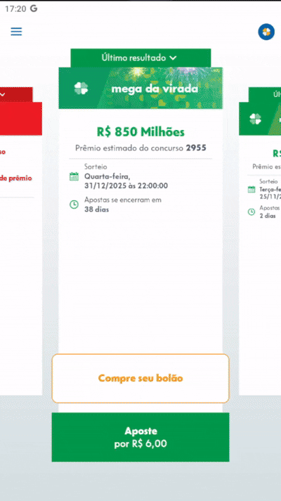
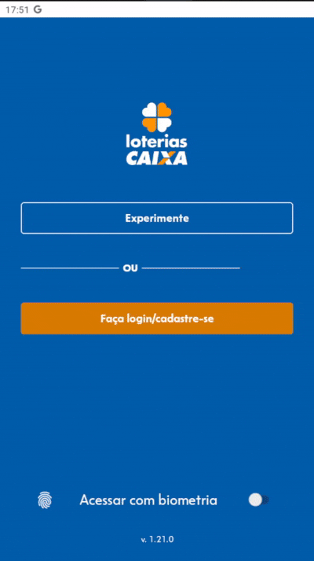
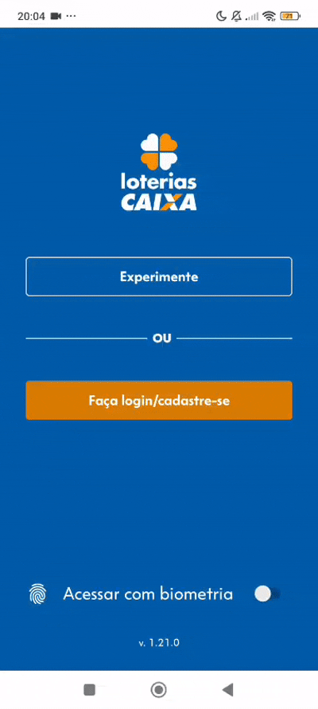
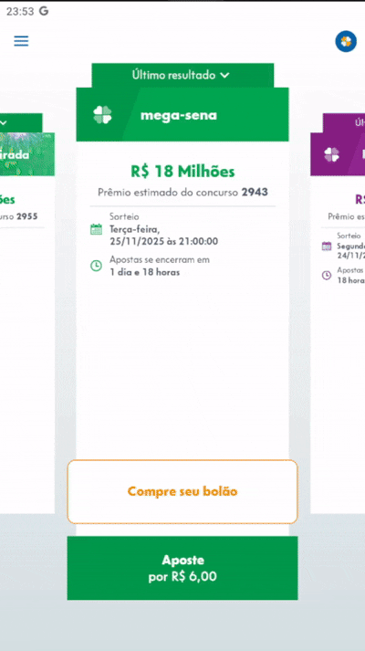

## Introdução
O Modelo de Toranzo organiza a rastreabilidade de requisitos de software ao longo de todo o ciclo de vida do sistema, permitindo identificar as relações entre artefatos como requisitos, código, casos de uso e testes. Ele utiliza diferentes tipos de elos — satisfação, recurso, representação, alocação e agregação — para garantir a rastreabilidade bidirecional (forward e backward), possibilitando acompanhar a implementação, verificar impactos de mudanças e assegurar a consistência entre os artefatos do projeto.

## RF01 O usuário deve receber Comprovantes de seus ganhos e apostas

| **RF01**  | Classificação do Artefato Analisado |
| --- | --- |
| Tipos de Elo | Artefatos Relacionados |
| Satisfação | - |
| Recurso | - |
| Representação |  |
| Alocado | [L06](../Modelagem/Léxicos.md#L06) |
| Agregação | [HU06](../Modelagem/Ágil/História%20de%20usuário.md#HU06) |

##  RF02  O usuário deve ter mais de uma opção de aposta

| **RF02**  | Classificação do Artefato Analisado |
| --- | --- |
| Tipos de Elo | Artefatos Relacionados |
| Satisfação | - |
| Recurso | [CN03](../Modelagem/Cenários.md#CN03) |
| Representação |  |
| Alocado | [L07](../Modelagem/Léxicos.md#L07) |
| Agregação | - |

## RF03  O usuário deve poder acompanhar jogos pelo software

| **RF03**  | Classificação do Artefato Analisado |
| --- | --- |
| Tipos de Elo | Artefatos Relacionados |
| Satisfação | - |
| Recurso | - |
| Representação |  |
| Alocado | [L08](../Modelagem/Léxicos.md#L08) |
| Agregação | [HU19](../Modelagem/Ágil/História%20de%20usuário.md#HU19) |

## RF04 O software deve ter poucas telas (menos que 20)	 

| **RF04**  | Classificação do Artefato Analisado |
| --- | --- |
| Tipos de Elo | Artefatos Relacionados |
| Satisfação | [Usabilidade](../Modelagem/Especificação%20Suplementar.md#Usabilidade) |
| Recurso | - |
| Representação | - |
| Alocado | [L05](../Modelagem/Léxicos.md#L05) |
| Agregação | [HU24](../Modelagem/Ágil/História%20de%20usuário.md#HU24) |

## RF05 O usuário deve poder consultar seus ganhos

| **RF05**  | Classificação do Artefato Analisado |
| --- | --- |
| Tipos de Elo | Artefatos Relacionados |
| Satisfação | - |
| Recurso | - |
| Representação |  |
| Alocado | [L11](../Modelagem/Léxicos.md#L11) |
| Agregação | [HU16](../Modelagem/Ágil/História%20de%20usuário.md#HU16) |

## RF06 O software deve ter opções de modo escuro e claro

| **RF06**  | Classificação do Artefato Analisado |
| --- | --- |
| Tipos de Elo | Artefatos Relacionados |
| Satisfação | [Suportabilidade](../Modelagem/Especificação%20Suplementar.md#Suportabilidade) |
| Recurso | [CN01](../Modelagem/Cenários.md#CN01) |
| Representação |  |
| Alocado | [L09](../Modelagem/Léxicos.md#L09) |
| Agregação | [HU01](../Modelagem/Ágil/História%20de%20usuário.md#HU01) |

## RF07 O usuário deve receber o resultado das apostas

| **RF07** | Classificação do Artefato Analisado |
| --- | --- |
| Tipos de Elo | Artefatos Relacionados |
| Satisfação | - |
| Recurso | - |
| Representação |  |
| Alocado | [L08](../Modelagem/Léxicos.md#L08) |
| Agregação | [HU03](../Modelagem/Ágil/História%20de%20usuário.md#HU03) |

## RF08  O usuário deve poder fazer login no aplicativo

| **RF08** | Classificação do Artefato Analisado |
| --- | --- |
| Tipos de Elo | Artefatos Relacionados |
| Satisfação | [Confiabilidade](../Modelagem/Especificação%20Suplementar.md#Confiabilidade) |
| Recurso | - |
| Representação |  |
| Alocado | [UC01](../Modelagem/Casos%20de%20uso.md#UC01), [L12](../Modelagem/Léxicos.md#L12) |
| Agregação | - |

## RF09  Deve haver uma verificação de identidade para login no aplicativo

| **RF09** | Classificação do Artefato Analisado |
| --- | --- |
| Tipos de Elo | Artefatos Relacionados |
| Satisfação | [Confiabilidade](../Modelagem/Especificação%20Suplementar.md#Confiabilidade) |
| Recurso | - |
| Representação |  |
| Alocado | [L12](../Modelagem/Léxicos.md#L12) |
| Agregação | [HU02](../Modelagem/Ágil/História%20de%20usuário.md#HU02), [HU14](../Modelagem/Ágil/História%20de%20usuário.md#HU14) |

## RF10 O usuário deve poder acessar o próprio perfil

| **RF10** | Classificação do Artefato Analisado |
| --- | --- |
| Tipos de Elo | Artefatos Relacionados |
| Satisfação | - |
| Recurso | - |
| Representação |  |
| Alocado | [L13](../Modelagem/Léxicos.md#L13) |
| Agregação | [HU23](../Modelagem/Ágil/História%20de%20usuário.md#HU23) |

## RF11  O usuário deve poder fazer logout no aplicativo

| **RF11** | Classificação do Artefato Analisado |
| --- | --- |
| Tipos de Elo | Artefatos Relacionados |
| Satisfação | - |
| Recurso | - |
| Representação |  |
| Alocado | [L14](../Modelagem/Léxicos.md#L14) |
| Agregação | [HU38](../Modelagem/Ágil/História%20de%20usuário.md#HU38) |

## RF12 - O aplicativo deve permitir que o usuário realize o cadastro com dados pessoais

| **RF12** | Classificação do Artefato Analisado |
| --- | --- |
| Tipos de Elo | Artefatos Relacionados |
| Satisfação | [Confiabilidade](../Modelagem/Especificação%20Suplementar.md#Confiabilidade) |
| Recurso | - |
| Representação |  |
| Alocado | [L15](../Modelagem/Léxicos.md#L15) |
| Agregação | [HU04](../Modelagem/Ágil/História%20de%20usuário.md#HU04) |

*
 Fonte: <a href= "https://github.com/Kael-web7">Miquéias Ezequiel</a> 
*

## RF13 - O aplicativo deve permitir interação com o menu de loterias ao clicar em experimentar

| **RF13** | Classificação do Artefato Analisado |
| --- | --- |
| Tipos de Elo | Artefatos Relacionados |
| Satisfação | - |
| Recurso | - |
| Representação |  |
| Alocado | [L16](../Modelagem/Léxicos.md#L16) |
| Agregação | [HU41](../Modelagem/Ágil/História%20de%20usuário.md#HU41) |

*
 Fonte: <a href= "https://github.com/Kael-web7">Miquéias Ezequiel</a> 
*

## RF14 - O aplicativo deve permitir login com CPF e senha ou com biometria

| **RF14** | Classificação do Artefato Analisado |
| --- | --- |
| Tipos de Elo | Artefatos Relacionados |
| Satisfação | [Confiabilidade](../Modelagem/Especificação%20Suplementar.md#Confiabilidade) |
| Recurso | - |
| Representação |  |
| Alocado | [L12](../Modelagem/Léxicos.md#L12) |
| Agregação | - |

*
 Fonte: <a href= "https://github.com/Kael-web7">Miquéias Ezequiel</a> 
*

## RF15 - O aplicativo deve exibir os tipos de loteria disponíveis (Mega-Sena, Lotofácil etc.)

| **RF15** | Classificação do Artefato Analisado |
| --- | --- |
| Tipos de Elo | Artefatos Relacionados |
| Satisfação | - |
| Recurso | - |
| Representação |  |
| Alocado | [UC01](../Modelagem/Casos%20de%20uso.md#UC01), [UC02](../Modelagem/Casos%20de%20uso.md#UC02), [L16](../Modelagem/Léxicos.md#L16) |
| Agregação | [HU15](../Modelagem/Ágil/História%20de%20usuário.md#HU15) |

*
 Fonte: <a href= "https://github.com/Kael-web7">Miquéias Ezequiel</a> 
*

## RF16 - O aplicativo deve exibir o último resultado do sorteio de cada loteria

| **RF16** | Classificação do Artefato Analisado |
| --- | --- |
| Tipos de Elo | Artefatos Relacionados |
| Satisfação | - |
| Recurso | - |
| Representação |  |
| Alocado | [UC02](../Modelagem/Casos%20de%20uso.md#UC02), [L16](../Modelagem/Léxicos.md#L16) |
| Agregação | [HU05](../Modelagem/Ágil/História%20de%20usuário.md#HU05), [HU18](../Modelagem/Ágil/História%20de%20usuário.md#HU18) |

*
 Fonte: <a href= "https://github.com/Kael-web7">Miquéias Ezequiel</a> 
*

## RF17 - O aplicativo deve possibilitar a escolha de números para fazer uma aposta

| **RF17** | Classificação do Artefato Analisado |
| --- | --- |
| Tipos de Elo | Artefatos Relacionados |
| Satisfação | - |
| Recurso | - |
| Representação |  |
| Alocado | [L16](../Modelagem/Léxicos.md#L16) |
| Agregação | [HU33](../Modelagem/Ágil/História%20de%20usuário.md#HU33) |

*
 Fonte: <a href= "https://github.com/Kael-web7">Miquéias Ezequiel</a> 
*

## RF18 - O aplicativo deve permitir limpar a seleção feita

| **RF18** | Classificação do Artefato Analisado |
| --- | --- |
| Tipos de Elo | Artefatos Relacionados |
| Satisfação | - |
| Recurso | - |
| Representação |  |
| Alocado | [L16](../Modelagem/Léxicos.md#L16) |
| Agregação | - |

*
 Fonte: <a href= "https://github.com/Kael-web7">Miquéias Ezequiel</a> 
*

## RF19 - O aplicativo deve permitir completar a aposta com números aleatórios

| **RF19** | Classificação do Artefato Analisado |
| --- | --- |
| Tipos de Elo | Artefatos Relacionados |
| Satisfação | - |
| Recurso | [CN01](../Modelagem/Cenários.md#CN01) |
| Representação |  |
| Alocado | [L16](../Modelagem/Léxicos.md#L16) |
| Agregação | [HU34](../Modelagem/Ágil/História%20de%20usuário.md#HU34) |

*
 Fonte: <a href= "https://github.com/Kael-web7">Miquéias Ezequiel</a> 
*

## RF20 - O aplicativo deve permitir adicionar o jogo ao carrinho de apostas

| **RF20** | Classificação do Artefato Analisado |
| --- | --- |
| Tipos de Elo | Artefatos Relacionados |
| Satisfação | - |
| Recurso | [CN02](../Modelagem/Cenários.md#CN02) |
| Representação |  |
| Alocado | [L17](../Modelagem/Léxicos.md#L17) |
| Agregação | [HU35](../Modelagem/Ágil/História%20de%20usuário.md#HU35) |

*
 Fonte: <a href= "https://github.com/luannvi">Luan Vinícius</a> 
*

## RF21 - O aplicativo deve calcular automaticamente o valor da aposta

| **RF21** | Classificação do Artefato Analisado |
| --- | --- |
| Tipos de Elo | Artefatos Relacionados |
| Satisfação | - |
| Recurso | - |
| Representação |  |
| Alocado | [UC03](../Modelagem/Casos%20de%20uso.md#UC03), [L17](../Modelagem/Léxicos.md#L17) |
| Agregação | - |

*
 Fonte: <a href= "https://github.com/luannvi">Luan Vinícius</a> 
*

## RF22 - O aplicativo deve possibilitar pagamento via cartão de crédito ou PIX

| **RF22** | Classificação do Artefato Analisado |
| --- | --- |
| Tipos de Elo | Artefatos Relacionados |
| Satisfação | - |
| Recurso | - |
| Representação |  |
| Alocado | [UC03](../Modelagem/Casos%20de%20uso.md#UC03), [L18](../Modelagem/Léxicos.md#L18) |
| Agregação | - |

*
 Fonte: <a href= "https://github.com/luannvi">Luan Vinícius</a> 
*

## RF23 - O aplicativo deve permitir pagamento de apostas utilizando carteiras digitais como Google Pay, Apple Pay.

| **RF23** | Classificação do Artefato Analisado |
| --- | --- |
| Tipos de Elo | Artefatos Relacionados |
| Satisfação | - |
| Recurso | [CN05](../Modelagem/Cenários.md#CN05) |
| Representação |  |
| Alocado | [L18](../Modelagem/Léxicos.md#L18) |
| Agregação | [HU17](../Modelagem/Ágil/História%20de%20usuário.md#HU17) |

*
 Fonte: <a href= "https://github.com/luannvi">Luan Vinícius</a> 
*

## RF24 - O aplicativo deve mostrar se o pagamento foi confirmado

| **RF24** | Classificação do Artefato Analisado |
| --- | --- |
| Tipos de Elo | Artefatos Relacionados |
| Satisfação | [Confiabilidade](../Modelagem/Especificação%20Suplementar.md#Confiabilidade) |
| Recurso | - |
| Representação |  |
| Alocado | [L17](../Modelagem/Léxicos.md#L17) |
| Agregação | - |

*
 Fonte: <a href= "https://github.com/luannvi">Luan Vinícius</a> 
*

## RF25 - O aplicativo deve permitir visualizar sua aposta

| **RF25** | Classificação do Artefato Analisado |
| --- | --- |
| Tipos de Elo | Artefatos Relacionados |
| Satisfação | - |
| Recurso | [CN04](../Modelagem/Cenários.md#CN04) |
| Representação |  |
| Alocado | [UC03](../Modelagem/Casos%20de%20uso.md#UC03), [L17](../Modelagem/Léxicos.md#L17) |
| Agregação | - |

*
 Fonte: <a href= "https://github.com/luannvi">Luan Vinícius</a> 
*

## RF26 - O aplicativo deve permitir gerar o comprovante da aposta em "minhas apostas"

| **RF26** | Classificação do Artefato Analisado |
| --- | --- |
| Tipos de Elo | Artefatos Relacionados |
| Satisfação | [Confiabilidade](../Modelagem/Especificação%20Suplementar.md#Confiabilidade) |
| Recurso | - |
| Representação |  |
| Alocado | [UC05](../Modelagem/Casos%20de%20uso.md#UC05), [L06](../Modelagem/Léxicos.md#L06) |
| Agregação | [HU40](../Modelagem/Ágil/História%20de%20usuário.md#HU40) |

*
 Fonte: <a href= "https://github.com/luannvi">Luan Vinícius</a> 
*

## RF27 - O aplicativo deve possibilitar logout do usuário

| **RF27** | Classificação do Artefato Analisado |
| --- | --- |
| Tipos de Elo | Artefatos Relacionados |
| Satisfação | - |
| Recurso | - |
| Representação |  |
| Alocado | [L14](../Modelagem/Léxicos.md#L14) |
| Agregação | - |

*
 Fonte: <a href= "https://github.com/luannvi">Luan Vinícius</a> 
*

## RF28 - O aplicativo deve permitir o cancelamento de apostas antes do sorteio

| **RF28** | Classificação do Artefato Analisado |
| --- | --- |
| Tipos de Elo | Artefatos Relacionados |
| Satisfação | - |
| Recurso | [CN06](../Modelagem/Cenários.md#CN06) |
| Representação |  |
| Alocado | [L19](../Modelagem/Léxicos.md#L19) |
| Agregação | [HU20](../Modelagem/Ágil/História%20de%20usuário.md#HU20) |

*
 Fonte: <a href= "https://github.com/luannvi">Luan Vinícius</a> 
*

## RF29 - A realização de pagamento das apostas são acessíveis a quem usa o aplicativo, sendo cartão de crédito e débito ou Pix

| **RF29** | Classificação do Artefato Analisado |
| --- | --- |
| Tipos de Elo | Artefatos Relacionados |
| Satisfação | - |
| Recurso | - |
| Representação |  |
| Alocado | [L18](../Modelagem/Léxicos.md#L18) |
| Agregação | - |

*
 Fonte: <a href= "https://github.com/TerminaKng05">Samuel Felipe</a> 
*

## RF30 - O aplicativo apresenta todos os resultados e as arrecadações dos concursos, como também estimativa para os próximos sorteios

| **RF30** | Classificação do Artefato Analisado |
| --- | --- |
| Tipos de Elo | Artefatos Relacionados |
| Satisfação | - |
| Recurso | - |
| Representação |  |
| Alocado | - |
| Agregação | - |

*
 Fonte: <a href= "https://github.com/TerminaKng05">Samuel Felipe</a> 
*

## RF31 - O aplicativo apresenta uma aba de transparência e prestação de contas à sociedade chamada de "Repasses Sociais", onde há os valores repassados pelas Loterias CAIXA em áreas de desenvolvimento social

| **RF31** | Classificação do Artefato Analisado |
| --- | --- |
| Tipos de Elo | Artefatos Relacionados |
| Satisfação | - |
| Recurso | - |
| Representação |  |
| Alocado | [L28](../Modelagem/Léxicos.md#L28) |
| Agregação | - |

*
 Fonte: <a href= "https://github.com/TerminaKng05">Samuel Felipe</a> 
*

## RF32 - O aplicativo apresenta funções de acessibilidade aos idosos e deficientes

| **RF32** | Classificação do Artefato Analisado |
| --- | --- |
| Tipos de Elo | Artefatos Relacionados |
| Satisfação | [Usabilidade](../Modelagem/Especificação%20Suplementar.md#Usabilidade) |
| Recurso | [CN11](../Modelagem/Cenários.md#CN11) |
| Representação |  |
| Alocado | [L04](../Modelagem/Léxicos.md#L04) |
| Agregação | [HU08](../Modelagem/Ágil/História%20de%20usuário.md#HU08), [CNFR03](../Modelagem/Ágil/NFR.md#CNFR03) |

*
 Fonte: <a href= "https://github.com/Jadequilin">João Pedro</a> 
*

## RF33 - As opções de ações dentro do aplicativo são acessíveis em 3 cliques para o apostante

| **RF33** | Classificação do Artefato Analisado |
| --- | --- |
| Tipos de Elo | Artefatos Relacionados |
| Satisfação | [Usabilidade](../Modelagem/Especificação%20Suplementar.md#Usabilidade) |
| Recurso | - |
| Representação |  |
| Alocado | [L20](../Modelagem/Léxicos.md#L20) |
| Agregação | - |

*
 Fonte: <a href= "https://github.com/Jadequilin">João Pedro</a> 
*

## RF34 - Os dados do usuário são mantidos em sigilo e protegidos

| **RF34** | Classificação do Artefato Analisado |
| --- | --- |
| Tipos de Elo | Artefatos Relacionados |
| Satisfação | [Confiabilidade](../Modelagem/Especificação%20Suplementar.md#Confiabilidade) |
| Recurso | - |
| Representação | - |
| Alocado | - |
| Agregação | [HU26](../Modelagem/Ágil/História%20de%20usuário.md#HU26) |

*
 Fonte: <a href= "https://github.com/Jadequilin">João Pedro</a> 
*

## RF35 - As páginas do aplicativo mais usadas pelo usuário estão em destaque na tela

| **RF35** | Classificação do Artefato Analisado |
| --- | --- |
| Tipos de Elo | Artefatos Relacionados |
| Satisfação | [Usabilidade](../Modelagem/Especificação%20Suplementar.md#Usabilidade) |
| Recurso | [CN09](../Modelagem/Cenários.md#CN09) |
| Representação | - |
| Alocado | [L02](../Modelagem/Léxicos.md#L02) |
| Agregação | [HU09](../Modelagem/Ágil/História%20de%20usuário.md#HU09) |

*
 Fonte: <a href= "https://github.com/Jadequilin">João Pedro</a> 
*

## RF36 - O sistema fornece avisos ao usuário sobre seu limite diário de apostas

| **RF36** | Classificação do Artefato Analisado |
| --- | --- |
| Tipos de Elo | Artefatos Relacionados |
| Satisfação | [Confiabilidade](../Modelagem/Especificação%20Suplementar.md#Confiabilidade) |
| Recurso | [CN08](../Modelagem/Cenários.md#CN08) |
| Representação |  |
| Alocado | [L01](../Modelagem/Léxicos.md#L01) |
| Agregação | [HU10](../Modelagem/Ágil/História%20de%20usuário.md#HU10) |

*
 Fonte: <a href= "https://github.com/Jadequilin">João Pedro</a> 
*

## RF37 - O sistema apresenta uma tela chamada "favoritos", onde o apostante consegue realizar jogos com base nas suas preferências de aposta

| **RF37** | Classificação do Artefato Analisado |
| --- | --- |
| Tipos de Elo | Artefatos Relacionados |
| Satisfação | - |
| Recurso | - |
| Representação |  |
| Alocado | [L02](../Modelagem/Léxicos.md#L02) |
| Agregação | - |

*
 Fonte: <a href= "https://github.com/TerminaKng05">Samuel Felipe</a> 
*

## RF38 - O aplicativo deve permitir mudar e remover foto de perfil

| **RF38** | Classificação do Artefato Analisado |
| --- | --- |
| Tipos de Elo | Artefatos Relacionados |
| Satisfação | - |
| Recurso | - |
| Representação |  |
| Alocado | [L13](../Modelagem/Léxicos.md#L13) |
| Agregação | - |

*
 Fonte: <a href= "https://github.com/Kael-web7">Miqueias Ezequiel</a> 
*

## RF39 - O sistema notifica o apostante quando sua aposta foi premiada

| **RF39** | Classificação do Artefato Analisado |
| --- | --- |
| Tipos de Elo | Artefatos Relacionados |
| Satisfação | - |
| Recurso | - |
| Representação |  |
| Alocado | [L31](../Modelagem/Léxicos.md#L31) |
| Agregação | [HU12](../Modelagem/Ágil/História%20de%20usuário.md#HU12) |

*
 Fonte: <a href= "https://github.com/TerminaKng05">Samuel Felipe</a> 
*

## RF40 - O aplicativo notifica o usuário dentro do próprio app quando sua aposta é premiada

| **RF40** | Classificação do Artefato Analisado |
| --- | --- |
| Tipos de Elo | Artefatos Relacionados |
| Satisfação | - |
| Recurso | [CN13](../Modelagem/Cenários.md#CN13) |
| Representação |  |
| Alocado | [L31](../Modelagem/Léxicos.md#L31) |
| Agregação | [HU12](../Modelagem/Ágil/História%20de%20usuário.md#HU12), [HU30](../Modelagem/Ágil/História%20de%20usuário.md#HU30) |

*
 Fonte: <a href= "https://github.com/RivaFilho">Rivadalvio</a> 
*

## RNF01  O software deve ter telas simples com poucos elementos 

| **RNF01** | Classificação do Artefato Analisado |
| --- | --- |
| Tipos de Elo | Artefatos relacionados |
| Satisfação | [Suportabilidade](../Modelagem/Especificação%20Suplementar.md#Suportabilidade), [Usabilidade](../Modelagem/Especificação%20Suplementar.md#Usabilidade) |
| Recurso | - |
| Representação | - |
| Alocado | [L05](../Modelagem/Léxicos.md#L05) |
| Agregação | [CNFR01](../Modelagem/Ágil/NFR.md#CNFR01) |

## RNF02 O software deve ter imagens explicativas que mostrem as funções principais do aplicativo, em uma aba especial só para elas

| **RNF02** | Classificação do Artefato Analisado |
| --- | --- |
| Tipos de Elo | Artefatos relacionados |
| Satisfação | [Usabilidade](../Modelagem/Especificação%20Suplementar.md#Usabilidade) |
| Recurso | [CN02](../Modelagem/Cenários.md#CN02) |
| Representação |  |
| Alocado | [L10](../Modelagem/Léxicos.md#L10) |
| Agregação | [HU13](../Modelagem/Ágil/História%20de%20usuário.md#HU13) |

## RNF03 - A navegação entre a seleção de jogos, o preenchimento do volante e o carrinho de compras deve ser intuitiva, exigindo no máximo 4 toques

| **RNF03** | Classificação do Artefato Analisado |
| --- | --- |
| Tipos de Elo | Artefatos Relacionados |
| Satisfação | [Usabilidade](../Modelagem/Especificação%20Suplementar.md#Usabilidade) |
| Recurso | - |
| Representação |  |
| Alocado | [L20](../Modelagem/Léxicos.md#L20), [L30](../Modelagem/Léxicos.md#L30) |
| Agregação | [CNFR07](../Modelagem/Ágil/NFR.md#CNFR07) |

*
 Fonte: <a href= "https://github.com/Kael-web7">Miquéias Ezequiel</a> 
*

## RNF04 - O resultado de uma loteria deve ser carregado e exibido na tela em menos de 3 segundos sob uma conexão 4G/5G padrão

| **RNF04** | Classificação do Artefato Analisado |
| --- | --- |
| Tipos de Elo | Artefatos Relacionados |
| Satisfação | [Desempenho](../Modelagem/Especificação%20Suplementar.md#Desempenho) |
| Recurso | - |
| Representação | - |
| Alocado | [L21](../Modelagem/Léxicos.md#L21) |
| Agregação | [HU36](../Modelagem/Ágil/História%20de%20usuário.md#HU36), [CNFR08](../Modelagem/Ágil/NFR.md#CNFR08) |

*
 Fonte: <a href= "https://github.com/Kael-web7">Miquéias Ezequiel</a> 
*

## RNF05 - O sistema deve proteger o acesso às funcionalidades transacionais exigindo a autenticação do usuário no início da sessão

| **RNF05** | Classificação do Artefato Analisado |
| --- | --- |
| Tipos de Elo | Artefatos Relacionados |
| Satisfação | [Confiabilidade](../Modelagem/Especificação%20Suplementar.md#Confiabilidade) |
| Recurso | - |
| Representação | - |
| Alocado | [L12](../Modelagem/Léxicos.md#L12), [L22](../Modelagem/Léxicos.md#L22) |
| Agregação | - |

*
 Fonte: <a href= "https://github.com/Kael-web7">Miquéias Ezequiel</a> 
*

## RNF06 - Os números selecionados no volante digital devem ser claramente diferenciados dos não selecionados, através de cor e contraste

| **RNF06** | Classificação do Artefato Analisado |
| --- | --- |
| Tipos de Elo | Artefatos Relacionados |
| Satisfação | [Usabilidade](../Modelagem/Especificação%20Suplementar.md#Usabilidade) |
| Recurso | - |
| Representação |  |
| Alocado | - |
| Agregação | [HU07](../Modelagem/Ágil/História%20de%20usuário.md#HU07), [HU33](../Modelagem/Ágil/História%20de%20usuário.md#HU33), [CNFR09](../Modelagem/Ágil/NFR.md#CNFR09) |

*
 Fonte: <a href= "https://github.com/Kael-web7">Miquéias Ezequiel</a> 
*

## RNF07 - O aplicativo não deve apresentar erros ou fechar inesperadamente durante o processo de criação e pagamento de uma aposta

| **RNF07** | Classificação do Artefato Analisado |
| --- | --- |
| Tipos de Elo | Artefatos Relacionados |
| Satisfação | [Desempenho](../Modelagem/Especificação%20Suplementar.md#Desempenho), [Confiabilidade](../Modelagem/Especificação%20Suplementar.md#Confiabilidade) |
| Recurso | - |
| Representação | - |
| Alocado | [L22](../Modelagem/Léxicos.md#L22) |
| Agregação | [HU11](../Modelagem/Ágil/História%20de%20usuário.md#HU11), [CNFR10](../Modelagem/Ágil/NFR.md#CNFR10) |

*
 Fonte: <a href= "https://github.com/Kael-web7">Miquéias Ezequiel</a> 
*

## RNF08 - A transição de telas durante o fluxo de aposta não deve ter travamentos perceptíveis

| **RNF08** | Classificação do Artefato Analisado |
| --- | --- |
| Tipos de Elo | Artefatos Relacionados |
| Satisfação | [Usabilidade](../Modelagem/Especificação%20Suplementar.md), [Desempenho](../Modelagem/Especificação%20Suplementar.md) |
| Recurso | - |
| Representação | - |
| Alocado | - |
| Agregação | [CNFR02](../Modelagem/Ágil/NFR.md#CNFR02) |

*
 Fonte: <a href= "https://github.com/luannvi">Luan Vinícius</a> 
*

## RNF09 - O sistema deve exibir feedback visual em até 1 segundo, destacando o carrinho e mostrando uma confirmação na tela sempre que o usuário adicionar uma aposta.

| **RNF09** | Classificação do Artefato Analisado |
| --- | --- |
| Tipos de Elo | Artefatos Relacionados |
| Satisfação | [Usabilidade](../Modelagem/Especificação%20Suplementar.md) |
| Recurso | - |
| Representação | - |
| Alocado | - |
| Agregação | [HU22](../Modelagem/%C3%81gil/Hist%C3%B3ria%20de%20usu%C3%A1rio.md#HU22), [CNFR05](../Modelagem/Ágil/NFR.md#CNFR05) |

*
 Fonte: <a href= "https://github.com/luannvi">Luan Vinícius</a> 
*

## RNF10 - A sessão do usuário deve expirar automaticamente após 15 minutos de inatividade para proteger a conta

| **RNF10** | Classificação do Artefato Analisado |
| --- | --- |
| Tipos de Elo | Artefatos Relacionados |
| Satisfação | [Confiabilidade*](../Modelagem/Especificação%20Suplementar.md) |
| Recurso | - |
| Representação | - |
| Alocado | [L23](../Modelagem/L%C3%A9xicos.md#L23) |
| Agregação | [HU21](../Modelagem/Ágil/História%20de%20usuário.md#HU21), [CNFR06](../Modelagem/Ágil/NFR.md#CNFR06) |

*
 Fonte: <a href= "https://github.com/luannvi">Luan Vinícius</a> 
*

## RNF11 - O sistema deve garantir que o acesso a funcionalidades primárias seja feito através de componentes de interface autoexplicativos. Ícones de navegação, como o menu principal, devem ser acompanhados por um rótulo textual (ex: "Menu").

| **RNF11** | Classificação do Artefato Analisado |
| --- | --- |
| Tipos de Elo | Artefatos Relacionados |
| Satisfação | [Usabilidade](../Modelagem/Especificação%20Suplementar.md) |
| Recurso | [CN07](../Modelagem/Cen%C3%A1rios.md#CN07) |
| Representação |  |
| Alocado | [L24](../Modelagem/L%C3%A9xicos.md#L24) |
| Agregação | [HU32](../Modelagem/Ágil/História%20de%20usuário.md#HU32), [CNFR11](../Modelagem/Ágil/NFR.md#CNFR11), [CNFR07](../Modelagem/Ágil/NFR.md#CNFR07) |

*
 Fonte: <a href= "https://github.com/luannvi">Luan Vinícius</a> 
*

## RNF12 - As apostas são registradas dentro do app com base no CPF do usuário

| **RNF12** | Classificação do Artefato Analisado |
| --- | --- |
| Tipos de Elo | Artefatos Relacionados |
| Satisfação | [Confiabilidade](../Modelagem/Especifica%C3%A7%C3%A3o%20Suplementar.md#Confiabilidade) |
| Recurso | - |
| Representação | - |   
| Alocado | [L15](../Modelagem/L%C3%A9xicos.md#L15), [L26](../Modelagem/L%C3%A9xicos.md#L26) |
| Agregação | [CNFR12](../Modelagem/%C3%81gil/NFR.md#CNFR12) |

*
 Fonte: <a href= "https://github.com/TerminaKng05">Samuel Felipe</a> 
*

## RNF13 - O aplicativo segue a questão de disponibilidade em plataformas que os usuários tem acesso (IOS 15.1 ou superior/Apple Store, Android 5.1 ou superior/Play Store);

| **RNF13** | Classificação do Artefato Analisado |
| --- | --- |
| Tipos de Elo | Artefatos Relacionados  |
| Satisfação | [Suportabilidade](../Modelagem/Especificação%20Suplementar.md), [Design e Implementação](../Modelagem/Especifica%C3%A7%C3%A3o%20Suplementar.md#Design-e-Implementa%C3%A7%C3%A3o)   |
| Recurso | - |
| Representação | - |
| Alocado | [L25](../Modelagem/L%C3%A9xicos.md#L25) |
| Agregação | [HU27](../Modelagem/%C3%81gil/Hist%C3%B3ria%20de%20usu%C3%A1rio.md#HU27) |

*
 Fonte: <a href= "https://github.com/TerminaKng05">Samuel Felipe</a> 
*

## RNF14 - O aplicativo utiliza o sistema da própria empresa para que o usuário consiga acessar os seus dados no sistema

| **RNF14** | Classificação do Artefato Analisado |
| --- | --- |
| Tipos de Elo | Artefatos Relacionados  |
| Satisfação | [Confiabilidade](../Modelagem/Especificação%20Suplementar.md), [Design e Implementação](../Modelagem/Especifica%C3%A7%C3%A3o%20Suplementar.md#Design-e-Implementa%C3%A7%C3%A3o)  |
| Recurso | - |
| Representação | - |
| Alocado | [L26](../Modelagem/L%C3%A9xicos.md#L26) |
| Agregação | -|

*
 Fonte: <a href= "https://github.com/TerminaKng05">Samuel Felipe</a> 
*

## RNF15 - O aplicativo entrega as facilidades para realizar as mesmas funções que o site ou ir pessoalmente a uma lotérica

| **RNF15** | Classificação do Artefato Analisado |
| --- | --- |
| Tipos de Elo | Artefatos Relacionados  |
| Satisfação | [Design e Implementação](../Modelagem/Especifica%C3%A7%C3%A3o%20Suplementar.md#Design-e-Implementa%C3%A7%C3%A3o)  |
| Recurso | - |
| Representação | - |
| Alocado | [L27](../Modelagem/L%C3%A9xicos.md#L27) |
| Agregação | [CNFR14](../Modelagem/%C3%81gil/NFR.md#CNFR14) |

*
 Fonte: <a href= "https://github.com/TerminaKng05">Samuel Felipe</a> 
*

## RNF16 - O aplicativo segue a lei federal onde apenas maiores de 18 anos podem utilizar as funções que o mesmo oferece

| **RNF16** | Classificação do Artefato Analisado |
| --- | --- |
| Tipos de Elo | Artefatos Relacionados  |
| Satisfação | [Confiabilidade](../Modelagem/Especifica%C3%A7%C3%A3o%20Suplementar.md#Confiabilidade) |
| Recurso | - |
| Representação |  |
| Alocado | - |
| Agregação | [CNFR14](../Modelagem/%C3%81gil/NFR.md#CNFR14) |

*
 Fonte: <a href= "https://github.com/TerminaKng05">Samuel Felipe</a> 
*

## RNF17 - O aplicativo apresenta uma funcionalidade chamada "rapidão", onde é montada uma aposta com base nas preferências do usuário

| **RNF17** | Classificação do Artefato Analisado |
| --- | --- |
| Tipos de Elo | Artefatos Relacionados  |
| Satisfação | - |
| Recurso | - |
| Representação | - |
| Alocado | [L29](../Modelagem/L%C3%A9xicos.md#L29) |
| Agregação | [HU37](../Modelagem/%C3%81gil/Hist%C3%B3ria%20de%20usu%C3%A1rio.md#HU37) |

*
 Fonte: <a href= "https://github.com/TerminaKng05">Samuel Felipe</a> 
*

## RNF18 - O resgate dos prêmios são apenas disponibilizados nos canais oficiais da empresa, como uma Unidade Lotérica ou Agência Caixa, e no Mercado Pago (Sendo o valor disponível na conta do usuário e ser transferido conforme as regras próprias do meio de pagamento)

| **RNF18** | Classificação do Artefato Analisado |
| --- | --- |
| Tipos de Elo | Artefatos Relacionados  |
| Satisfação | [Confiabilidade](../Modelagem/Especifica%C3%A7%C3%A3o%20Suplementar.md#Confiabilidade) |
| Recurso | - |
| Representação | - |
| Alocado | [L30](../Modelagem/L%C3%A9xicos.md#L30) |
| Agregação | - |

*
 Fonte: <a href= "https://github.com/TerminaKng05">Samuel Felipe</a> 
*

## RNF19 - O aplicativo apresenta a opção de filtrar as apostas premiadas ou concursos não realizados

| **RNF19** | Classificação do Artefato Analisado |
| --- | --- |
| Tipos de Elo | Artefatos Relacionados  |
| Satisfação | [Design e Implementação](../Modelagem/Especifica%C3%A7%C3%A3o%20Suplementar.md#Design-e-Implementa%C3%A7%C3%A3o)  |
| Recurso | - |
| Representação |  |
| Alocado | - |
| Agregação |[HU11](../Modelagem/%C3%81gil/Hist%C3%B3ria%20de%20usu%C3%A1rio.md#HU11) |

*
 Fonte: <a href= "https://github.com/TerminaKng05">Samuel Felipe</a> 
*

## RNF20 - O aplicativo deve apresentar uma forma de mostrar os resultados em tempo real

| **RNF20** | Classificação do Artefato Analisado |
| --- | --- |
| Tipos de Elo | Artefatos Relacionados |
| Satisfação | [Design e Implementação](../Modelagem/Especifica%C3%A7%C3%A3o%20Suplementar.md#Design-e-Implementa%C3%A7%C3%A3o) |
| Recurso | [CN15](../Modelagem/Cen%C3%A1rios.md#CN15) |
| Representação |  |
| Alocado | [L06](../Modelagem/L%C3%A9xicos.md#L06) |
| Agregação | [HU31](../Modelagem/%C3%81gil/Hist%C3%B3ria%20de%20usu%C3%A1rio.md#HU31)|

*
 Fonte: <a href= "https://github.com/TerminaKng05">Samuel Felipe</a> 
*

## RNF21 - O aplicativo mostra os resultado dos jogos realizados em "tempo real", com 5 segundos de atraso máximo

| **RNF21** | Classificação do Artefato Analisado |
| --- | --- |
| Tipos de Elo | Artefatos Relacionados |
| Satisfação | [Desempenho](../Modelagem/Especifica%C3%A7%C3%A3o%20Suplementar.md#Desempenho)  |
| Recurso | [CN14](../Modelagem/Cen%C3%A1rios.md#CN14) |
| Representação | - |
| Alocado | [UC04](../Modelagem/Casos%20de%20uso.md#UC04), [L08](../Modelagem/L%C3%A9xicos.md#L08) |
| Agregação | [HU39](../Modelagem/%C3%81gil/Hist%C3%B3ria%20de%20usu%C3%A1rio.md#HU39)|

*
 Fonte: <a href= "https://github.com/TerminaKng05">Samuel Felipe</a> 
*

## RNF22 - Em dispositivos anteriores ao Android 5.1 e iOS 15.1, o aplicativo é estável para uso

| **RNF22** | Classificação do Artefato Analisado |
| --- | --- |
| Tipos de Elo | Artefatos Relacionados |
| Satisfação | [Desempenho](../Modelagem/Especifica%C3%A7%C3%A3o%20Suplementar.md#Desempenho) |
| Recurso | - |
| Representação | - |
| Alocado | - |
| Agregação | [CNFR04](../Modelagem/%C3%81gil/NFR.md#CNFR04) |

*
 Fonte: <a href= "https://github.com/TerminaKng05">Samuel Felipe</a> 
*

## RNF23 - O aplicativo funciona ao utilizar conexão de internet 4G/5G

| **RNF23** | Classificação do Artefato Analisado |
| --- | --- |
| Tipos de Elo | Artefatos Relacionados |
| Satisfação | [Desempenho](../Modelagem/Especifica%C3%A7%C3%A3o%20Suplementar.md#Desempenho), [Usabilidade](../Modelagem/Especifica%C3%A7%C3%A3o%20Suplementar.md#Usabilidade) |
| Recurso | - |
| Representação | - |
| Alocado | - |
| Agregação | [HU42](../Modelagem/Ágil/História%20de%20usuário.md)|

*
 Fonte: <a href= "https://github.com/TerminaKng05">Samuel Felipe</a> 
*

## RNF24 - O aplicativo é encontrado, pesquisado e utilizado de forma que o apostante sabe o que procura

| **RNF24** | Classificação do Artefato Analisado |
| --- | --- |
| Tipos de Elo | Artefatos Relacionados |
| Satisfação | [Design](../Modelagem/Especificação%20Suplementar.md#Design) |
| Recurso | [CN15](../Modelagem/Cenários.md#CN15) |
| Representação | - |
| Alocado | [CNFR10](../Modelagem/Ágil/NFR.md#CNFR10) |
| Agregação | [HU23](../Modelagem/Ágil/História%20de%20usuário.md#HU23) |

*
 Fonte: <a href= "https://github.com/Jadequilin">João Pedro</a> 
*

## RNF25 - O aplicativo é de uma fonte confiável para o usuário

| **RNF25** | Classificação do Artefato Analisado |
| --- | --- |
| Tipos de Elo | Artefatos Relacionados |
| Satisfação | [Confiabilidade](../Modelagem/Especificação%20Suplementar.md#Confiabilidade) |
| Recurso | [CN14](../Modelagem/Cenários.md#CN14) |
| Representação | - |
| Alocado | [CNFR12](../Modelagem/Ágil/NFR.md#CNFR12) |
| Agregação | [HU27](../Modelagem/Ágil/História%20de%20usuário.md#HU27) |

*
 Fonte: <a href= "https://github.com/Jadequilin">João Pedro</a> 
*

## RNF26 - Há um termo de uso

| **RNF26** | Classificação do Artefato Analisado |
| --- | --- |
| Tipos de Elo | Artefatos Relacionados |
| Satisfação | [Design](../Modelagem/Especificação%20Suplementar.md#Design) |
| Recurso | [CN10](../Modelagem/Cenários.md#CN10) |
| Representação |  |
| Alocado | [L03](../Modelagem/L%C3%A9xicos.md#L03), [CNFR10](../Modelagem/Ágil/NFR.md#CNFR10) |
| Agregação | [HU07](../Modelagem/Ágil/História%20de%20usuário.md#HU07) |

*
 Fonte: <a href= "https://github.com/Jadequilin">João Pedro</a> 
*

## RNF27 - O termo de uso especifica os riscos para o usuário

| **RNF27** | Classificação do Artefato Analisado |
| --- | --- |
| Tipos de Elo | Artefatos Relacionados |
| Satisfação | [Confiabilidade](../Modelagem/Especificação%20Suplementar.md#Confiabilidade) |
| Recurso | [CN10](../Modelagem/Cen%C3%A1rios.md#CN10) |
| Representação |  |
| Alocado | [L03](../Modelagem/L%C3%A9xicos.md#L03), [CNFR10](../Modelagem/Ágil/NFR.md#CNFR10) |
| Agregação | [HU07](../Modelagem/Ágil/História%20de%20usuário.md#HU07) |

*
 Fonte: <a href= "https://github.com/Jadequilin">João Pedro</a> 
*

## RNF28 - O termo de uso especifica a classificação indicativa para o usuário

| **RNF28** | Classificação do Artefato Analisado |
| --- | --- |
| Tipos de Elo | Artefatos Relacionados |
| Satisfação | [Design](../Modelagem/Especificação%20Suplementar.md#Design) |
| Recurso | [CN10](../Modelagem/Cenários.md#CN10) |
| Representação | - |
| Alocado | [CNFR14](../Modelagem/Ágil/NFR.md#CNFR14) |
| Agregação | [HU07](../Modelagem/Ágil/História%20de%20usuário.md#HU07) |

*
 Fonte: <a href= "https://github.com/Jadequilin">João Pedro</a> 
*

## RNF29 - O termo de uso especifica o acesso aos dados do aplicativo para o usuário

| **RNF29** | Classificação do Artefato Analisado |
| --- | --- |
| Tipos de Elo | Artefatos Relacionados |
| Satisfação | [Confiabilidade](../Modelagem/Especificação%20Suplementar.md#Confiabilidade) |
| Recurso | [CN10](../Modelagem/Cenários.md#CN10) |
| Representação | - |
| Alocado | [CNFR10](../Modelagem/Ágil/NFR.md#CNFR10) |
| Agregação | [HU07](../Modelagem/Ágil/História%20de%20usuário.md#HU07) |

*
 Fonte: <a href= "https://github.com/Jadequilin">João Pedro</a> 
*

## RNF30 - O aplicativo deve permitir que o usuário encontre qualquer modalidade de loteria ou resultado desejado em no máximo 2 toques e 3 segundos, com itens do menu claramente rotulados na tela inicial.

| **RNF30** | Classificação do Artefato Analisado |
| --- | --- |
| Tipos de Elo | Artefatos Relacionados |
| Satisfação | [Usabilidade](../Modelagem/Especificação%20Suplementar.md#Usabilidade) |
| Recurso | - |
| Representação | - |
| Alocado | [CNFR13](../Modelagem/Ágil/NFR.md#CNFR13) |
| Agregação | [HU29](../Modelagem/%C3%81gil/Hist%C3%B3ria%20de%20usu%C3%A1rio.md#HU29) |

*
 Fonte: <a href= "https://github.com/Jadequilin">João Pedro</a> 
*

## Agradecimentos
O grupo 7 agradece o apoio das ferramentas de inteligência artificial generativa - chatGPT, Google Gemini - na revisão gramatical e estilo de algumas partes do texto. As tecnologias foram utilizadas para organizar e deixar o texto mais claro, além de fornecer alguns exemplos de códigos de mkdocs para servir de referência para os autores. Todo o conteúdo, assim como a precisão técnica e as ideias apresentadas, permanecem de responsabilidade dos autores.

## Versionamento 

| Versão | Data       | Autor               | Descrição                                    | Revisor |
|:--------:|:------------:|:---------------------:|:----------------------------------------------:|:---------:|
| ``1.0``    | 10/10/2025 | [Heyttor Augusto](https://github.com/H3ytt0r62)   | Adição Modelo de Toranzo dos RF de Entrevista | [Samuel Felipe](https://github.com/TerminaKng05) |
| ``1.1``     | 11/10/2025 | [Samuel Felipe](https://github.com/TerminaKng05)    | Adição Modelo de Toranzo dos RF de Análise de Documento (RF29 a 32, RNF 12 a 23) | [Luan Vinícius](https://github.com/luannvi) |
| ``1.3``     | 11/10/2025 | [Miquéias Ezequiel](https://github.com/Kael-web7)    | Adição Modelo de Toranzo dos RF de Análise de Documento (RF29 a 32, RNF 12 a 23) | [Luan Vinícius](https://github.com/luannvi) |
| ``1.4``     | 28/10/2025 | [Nayra Silva Nery](https://github.com/NayraNery127)    | Adição da Introdução  | [Luan Vinícius](https://github.com/luannvi) |
| ``1.5``     | 28/10/2025 | [João Pedro](https://github.com/Jadequilin)    | Adição dos elos de RF33-37 e RNF24-30  | [Rivadalvio Joaquim](https://github.com/RivaFilho) |
| ``1.6`` | 07/11/2025 | [Samuel Felipe](https://github.com/TerminaKng05) | Adição Modelo de Toranzo do RF38 de Análise de Documento | [Heyttor Augusto](https://github.com/H3ytt0r62) |
| ``1.7``     | 20/11/2025 | [Miquéias Ezequiel](https://github.com/Kael-web7)    | Especificação aprimorada RNF09 e RNF30 | [Luan Vinícius](https://github.com/luannvi) |
| ``1.8`` | 20/11/2025 | [Samuel Felipe](https://github.com/TerminaKng05) | Atualização e modificação dos rfs e rnfs | [Heyttor Augusto](https://github.com/H3ytt0r62) |
| ``1.9`` | 23/11/2025 | [Luan Vinícius](https://github.com/luannvi) | Atualização da representação das tabelas | [Miquéias Ezequiel](https://github.com/Kael-web7) |
| ``2.0`` | 23/11/2025 | [Luan Vinícius](https://github.com/luannvi) | Adição RF40 | [Miquéias Ezequiel](https://github.com/Kael-web7) |
| ``2.1`` | 24/11/2025 | [Luan Vinícius](https://github.com/luannvi) | Preenchimento completo de todos os elos de rastreabilidade do Modelo de Toranzo | [Miquéias Ezequiel](https://github.com/Kael-web7) |