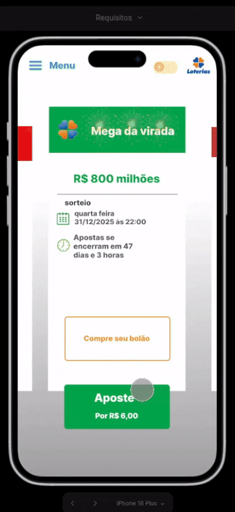
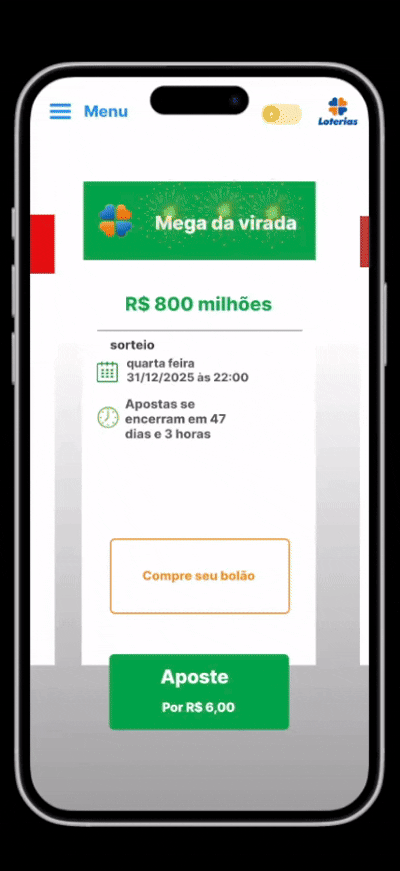
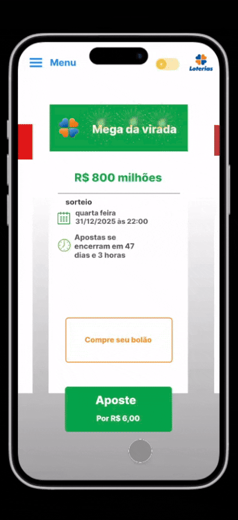

## Introdução 

A prototipação é muito importante para o desenvolvimento de um projeto, pois permite a construção de modelos iniciais que antecipam como o produto final deve se comportar. Estes protótipos também servem de ferramenta para validar os requisitos elicitados, pois ao longo do processo feedbacks são coletados de usuários a respeito dos protótipos e por meio deles podem se originar melhorias e correções no projeto.

A prototipagem pode ser classificada de acordo com seu nível de fidelidade, que varia desde representações simples em papel (baixa fidelidade) até modelos digitais altamente interativos (alta fidelidade), conforme o propósito e a fase do projeto. Os protótipos de baixa fidelidade são mais indicados nas etapas iniciais de concepção, pois facilitam a exploração de ideias de forma ágil e econômica. Já os de alta fidelidade são empregados em estágios mais avançados, proporcionando testes mais próximos da experiência real do usuário. Assim, a escolha do tipo de prototipagem tem impacto direto na qualidade das decisões relacionadas ao design, à usabilidade e à engenharia durante o desenvolvimento da solução. <a id="anchor_1" href="#REF1">[1]</a>

## Metodologia

Foi feito pelos estudantes uma prototipação de alta fidelidade para cada requisito funcional não implementado utilizando o site Figma, uma ferramenta de design online e colaborativa usada para criar interfaces (UI), websites e aplicativos. Cada protótipo possui uma tabela tal qual o modelo abaixo:

*Link do projeto no Figma: [Clique aqui](https://www.figma.com/design/CzSvBeUjJEhxiKMdd5ogea/Requisitos?node-id=0-1&p=f&t=1fsB75n44YYAcj6u-0)*

*
Tabela 1: Modelo da tabela
*

|Item | Descrição |
|-----|-----------|
|ID do Requisito| -  |
|Descrição | - |
|Representação | - |

*
Autor: <a href="https://github.com/H3ytt0r62">Heyttor Augusto</a>
*

Os requisitos representados são:

- RF06 - O software deve ter opções de modo claro e escuro;
- RF23 - O aplicativo deve permitir pagamento de apostas utilizando carteiras digitais como Google Pay, Apple Pay;
- RF28 - O aplicativo deve permitir o cancelamento de apostas antes do sorteio;
- RF32 - O aplicativo apresenta funções de acessibilidade aos idosos e deficientes;
- RF36 - O sistema fornece avisos ao usuário sobre seu limite diário de apostas;
- RF37 - O sistema apresenta uma tela chamada "favoritos", onde o apostante consegue realizar jogos com base nas suas preferências de aposta;
- RF38 - O aplicativo deve permitir mudar e remover foto de perfil;
- RF39 - O sistema notifica o apostante quando sua aposta foi premiada;
- RF40 - O aplicativo notifica o usuário dentro do próprio app quando sua aposta é premiada;
- RNF02 - O software deve ter imagens explicativas que mostrem as funções principais do aplicativo, em uma aba especial só para elas; 
- RNF11 - O sistema deve garantir que o acesso a funcionalidades primárias seja feito através de componentes de interface autoexplicativos. Ícones de navegação, como o menu principal, devem ser acompanhados por um rótulo textual (ex: "Menu");
- RNF20 - O aplicativo deve apresentar uma forma de mostrar os resultados em tempo real;
- RNF26 - O termo de uso especifica os riscos para o usuário.

## Tabela de contribuição 

|Aluno| Contribuição|
|-----|-------------|
|Heyttor augusto| prototipação do [RF06](#rf06), [RNF02](#rnf02)|
|Samuel Felipe| prototipação do [RF37](#rf37), [RF39](#rf39) |
|Miqueias Ezequiel| prototipação do [RF32](#rf32), [RF38](#rf38) |
| Luan Vinícius | prototipação do [RF28](#rf28), [RNF11](#rnf11) |
| João Pedro | prototipação do [RNF20](#rnf20),  [RNF26](#rnf26) |
| Rivadalvio Joaquim | prototipação do [RF23](#rf23), [RF40](#rf40) |
| Nayra Silva | prototipação do [RF36](#rf36) |

## Prototipações

## RF06 

|Item | Descrição |
|-----|-----------|
|ID Requisito| [RF06](../Pós-rastreabilidade/Backward%20from.md#RF06) |
|Descrição | O software deve ter opções de modo claro e escuro.  |
|Representação | |

## RF23

| Item | Descrição |
| ---- | --------- |
| id Requisito | [RF23](../Pós-rastreabilidade/Backward%20from.md#RF23) |
| Descrição | O aplicativo deve permitir pagamento de apostas utilizando carteiras digitais como Google Pay, Apple Pay. |
| Representação |  |

## RF28

| Item | Descrição |
| ---- | --------- |
| id Requisito | [RF28](../Pós-rastreabilidade/Backward%20from.md#RF28) |
| Descrição | O aplicativo deve permitir o cancelamento de apostas antes do sorteio. |
| Representação |  |

## RF32

| Item | Descrição |
| ---- | --------- |
| id Requisito | [RF32](../Pós-rastreabilidade/Backward%20from.md#RF32) |
| Descrição | O aplicativo apresenta funções de acessibilidade aos idosos e deficientes. |
| Representação |  |

## RF36

| Item | Descrição |
| ---- | --------- |
| id Requisito | [RF36](../Pós-rastreabilidade/Backward%20from.md#RF36) |
| Descrição | O sistema fornece avisos ao usuário sobre seu limite diário de apostas. |
| Representação |  |

## RF37

| Item | Descrição |
| ---- | --------- |
| id Requisito | [RF37](../Pós-rastreabilidade/Backward%20from.md#RF37) |
| Descrição | O sistema apresenta uma tela chamada "favoritos", onde o apostante consegue realizar jogos com base nas suas preferências de aposta. |
| Representação |  |

## RF38

| Item | Descrição |
| ---- | --------- |
| id Requisito | [RF38](../Pós-rastreabilidade/Backward%20from.md#RF38) |
| Descrição | O aplicativo deve permitir mudar e remover foto de perfil. |
| Representação |  |

## RF39

| Item | Descrição |
| ---- |---------- |
| id Requisito | [RF39](../Pós-rastreabilidade/Backward%20from.md#RF39) |
| Descrição | O sistema notifica o apostante quando sua aposta foi premiada. |
| Representação |  |

## RF40

| Item | Descrição |
| ---- |---------- |
| id Requisito | [RF40](../Pós-rastreabilidade/Backward%20from.md#RF40) |
| Descrição | O aplicativo notifica o usuário dentro do próprio app quando sua aposta é premiada. |
| Representação |  |

## RNF02

| Item | Descrição |
| ---- | --------- |
| id Requisito | [RNF02](../Pós-rastreabilidade/Backward%20from.md#RNF02) |
| Descrição | O software deve ter imagens explicativas que mostrem as funções principais do aplicativo, em uma aba especial só para elas. |
| Representação |  | 

## RNF11

| Item | Descrição |
| ---- | --------- |
| id Requisito | [RNF11](../Pós-rastreabilidade/Backward%20from.md#RNF11) |
| Descrição | O sistema deve garantir que o acesso a funcionalidades primárias seja feito através de componentes de interface autoexplicativos. Ícones de navegação, como o menu principal, devem ser acompanhados por um rótulo textual (ex: "Menu"). |
| Representação |  | 

## RNF20

| Item | Descrição |
| ---- | --------- |
| ID Requisito | [RNF20](../Pós-rastreabilidade/Backward%20from.md#RNF20) |
| Descrição | O aplicativo deve apresentar uma forma de mostrar os resultados em tempo real. |
| Representação |  |

## RNF26

| Item | Descrição |
| ---- | --------- |
| id Requisito | [RNF26](../Pós-rastreabilidade/Backward%20from.md#RNF26) |
| Descrição | O termo de uso especifica os riscos para o usuário. |
| Representação |  |

## Protótipo de alta fidelidade 

<iframe style="border: 1px solid rgba(0, 0, 0, 0.1);" width="800" height="450" src="https://embed.figma.com/proto/CzSvBeUjJEhxiKMdd5ogea/Requisitos?node-id=8-17&p=f&scaling=scale-down&content-scaling=fixed&page-id=0%3A1&starting-point-node-id=8%3A17&show-proto-sidebar=1&embed-host=share" allowfullscreen></iframe>

## Validação com o usuário

### RF06

Foi feita a validação com o usuário Marcio Junior, que aprovou o requisito prototipado.

<iframe width="560" height="315" src="https://www.youtube.com/embed/CZsvbXj02ow?si=x-n3-AK15ylOqrmv" title="YouTube video player" frameborder="0" allow="accelerometer; autoplay; clipboard-write; encrypted-media; gyroscope; picture-in-picture; web-share" referrerpolicy="strict-origin-when-cross-origin" allowfullscreen></iframe>

### RNF20 e RNF26

Foi feita a validação com o usuário Janice José Araújo, que aprovou o requisito prototipado.

<iframe width="560" height="315" src="https://www.youtube.com/embed/ntJu3T2l-Ag?si=30oja7dDXbRRzVmW" title="YouTube video player" frameborder="0" allow="accelerometer; autoplay; clipboard-write; encrypted-media; gyroscope; picture-in-picture; web-share" referrerpolicy="strict-origin-when-cross-origin" allowfullscreen></iframe>

### RF32 e RF38

Foi feita a validação com o usuário Matheus Queiroz, que aprovou o requisito prototipado.

<iframe width="560" height="315" src="https://www.youtube.com/embed/m_0x1l_aEvA?si=FZEw1v2PD716ONmq" title="YouTube video player" frameborder="0" allow="accelerometer; autoplay; clipboard-write; encrypted-media; gyroscope; picture-in-picture; web-share" referrerpolicy="strict-origin-when-cross-origin" allowfullscreen></iframe>

### RF23 e RF40

Foi feita a validação com o usuário Fernado samuel, que aprovou os requisitos prototipados.

<iframe width="560" height="315" src="https://www.youtube.com/e/m_0x1l_aEvA?si=F" title="YouTube video player" frameborder="0" allow="accelerometer; autoplay; clipboard-write; encrypted-media; gyroscope; picture-in-picture; web-share" referrerpolicy="strict-origin-when-cross-origin" allowfullscreen></iframe>

### RF37 e RF39

Foi feita a validação com a usuária Joelma de Almeida, que aprovou o requisito prototipado.

<iframe width="560" height="315" src="https://www.youtube.com/embed/3uuHRnVb84c?si=VCnIxh0AbUZF1Cpd" title="YouTube video player" frameborder="0" allow="accelerometer; autoplay; clipboard-write; encrypted-media; gyroscope; picture-in-picture; web-share" referrerpolicy="strict-origin-when-cross-origin" allowfullscreen></iframe>

## Agradecimentos 

O grupo 7 agradece o apoio das ferramentas de inteligência artificial generativa - chatGPT, Google Gemini - na revisão gramatical e estilo de algumas partes do texto. As tecnologias foram utilizadas para organizar e deixar o texto mais claro, além de fornecer alguns exemplos de códigos de mkdocs para servir de referência para os autores. Todo o conteúdo, assim como a precisão técnica e as ideias apresentadas, permanecem de responsabilidade dos autores.

## Referência bibliográfica

> <a id="REF1" href="#anchor_1">1.</a> UNIVERSIDADE VIRTUAL DO ESTADO DE SÃO PAULO (UNIVESP). Projeto e desenvolvimento do produto – Aula 12 – Prototipagem. YouTube, 21 jun. 2018. Disponível em: https://youtu.be/SBCNKHU37ZQ?si=hbDPHrf6FooMss_2. Acesso em: 04/11/2025.

## Versionamento

| Versão | Data | Descrição | Autor | Revisor |
|--------|------|-----------|-------|---------|
|``1.0``| 04/11/2025 | Inicialização do artefato| [Heyttor Augusto](https://github.com/H3ytt0r62) | -|
|``2.0``| 06/11/2025 | Adição do RF06 | [Heyttor Augusto](https://github.com/H3ytt0r62) | -|
| ``2.1`` | 07/11/2025 | Adição do RF38 | [Samuel Felipe](https://github.com/TerminaKng05) | [Heyttor Augusto](https://github.com/H3ytt0r62) |
| ``2.2``     | 07/11/2025 | Adição do RF33 | [Miquéias Ezequiel](https://github.com/Kael-web7) | [Luan Vinícius](https://github.com/luannvi) |
| ``2.3``     | 07/11/2025 | Adição do RF28 | [Luan Vinícius](https://github.com/luannvi) | [Miquéias Ezequiel](https://github.com/Kael-web7) |
| ``2.4``     | 11/11/2025 | Adição do RNF11 | [Luan Vinícius](https://github.com/luannvi) | [Miquéias Ezequiel](https://github.com/Kael-web7) |
| ``2.5``     | 12/11/2025 | Adição do RF39 | [Miquéias Ezequiel](https://github.com/Kael-web7) | [Luan Vinícius](https://github.com/luannvi) |
| ``2.6`` | 12/11/2025| Adição do RF40 | [Samuel Felipe](https://github.com/TerminaKng05) | [Heyttor Augusto](https://github.com/H3ytt0r62) |
| ``2.7`` | 19/11/2025 | Adição do RNF20 | [João Pedro](https://github.com/Jadequilin) | - |
| ``2.8`` | 19/11/2025 | Adição do RNF26 | [João Pedro](https://github.com/Jadequilin) | - |
| `` 2.9 `` | 20/11/2025 | Adição da seção de validação com o usuário | [João Pedro](https://github.com/Jadequilin) | - |
| ``3.0`` | 20/11/2025 | Atualização da numeração dos rfs | [Samuel Felipe](https://github.com/TerminaKng05) | [Heyttor Augusto](https://github.com/H3ytt0r62) |
| ``3.1``     | 21/11/2025 | Adição das tabelas restantes do protótipo, adição dos GIFs restantes, correções ortográficas no texto, atualização da tabela de contribuição, formato em ordem crescente dos requisitos  | [Luan Vinícius](https://github.com/luannvi) | [Miquéias Ezequiel]
| ``3.2`` | 22/11/2025 | Adição do RF23 e RF40 | [Rivadalvio Joaquim](https://github.com/RivaFilho) | - |
| ``3.3 `` | 23/11/2025 | Adição da validação com usuário (RF 37 e 39) | [Samuel Felipe](https://github.com/TerminaKng05) | [Heyttor Augusto](https://github.com/H3ytt0r62) |
