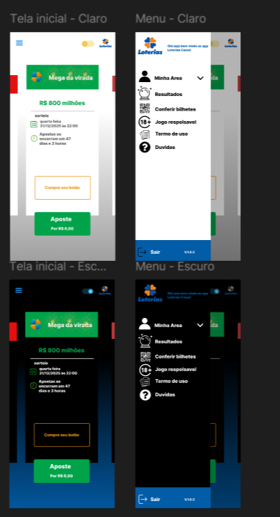

## Introdução 

A prototipação é muito importante para o desenvolvimento de um projeto, pois permite a construção de modelos inciais que antececipam como o produto final deve ser comportar. Estes prototipos tambem servem de ferramenta para validar os requisitos elicitados, pois ao longo do processo feedbacks são coletados de usuarios a respeito dos prototipos e com eles podem se originar melhorias e correções no projeto.

A prototipagem pode ser classificada de acordo com seu nível de fidelidade, que varia desde representações simples em papel (baixa fidelidade) até modelos digitais altamente interativos (alta fidelidade), conforme o propósito e a fase do projeto. Os protótipos de baixa fidelidade são mais indicados nas etapas iniciais de concepção, pois facilitam a exploração de ideias de forma ágil e econômica. Já os de alta fidelidade são empregados em estágios mais avançados, proporcionando testes mais próximos da experiência real do usuário. Assim, a escolha do tipo de prototipagem tem impacto direto na qualidade das decisões relacionadas ao design, à usabilidade e à engenharia durante o desenvolvimento da solução.

## Metodologia

Foi feito pelos estudantes uma prototipação de alta fidelidade para cada requisito funcional não implementado utilizando o site figma, uma ferramenta de design online e colaborativa usada para criar interfaces (UI), websites e aplicativos. Cada prototipo possui uma tabela tal qual o modelo abaixo:

Link do projeto figma: [clique aqui](https://www.figma.com/design/CzSvBeUjJEhxiKMdd5ogea/Requisitos?node-id=0-1&p=f&t=1fsB75n44YYAcj6u-0)

tabela 1 - modelo
autor: heyttor augusto

|Item | Descrição |
|-----|-----------|
|ID do Requisito| -  |
|Descrição | - |
|Representação | - |

Os requisitos representados são:

- RF06 - O software deve ter opções de modo claro e escuro 
- RF23 - O aplicativo deve permitir pagamento de apostas utilizando carteiras digitais como Google Pay, Apple Pay
- RF28 - O aplicativo deve permitir o cancelamento de apostas antes do sorteio
- RF33 - O aplicativo apresenta funções de acessibilidade aos idosos e deficientes
- RF36 - As páginas do aplicativo mais usadas pelo usuário estão em destaque na tela
- RF37 - O sistema fornece avisos ao usuário sobre seu limite diário de apostas 
- RF38 - O sistema apresenta uma tela chamada "favoritos", onde o apostante consegue realizar jogos com base nas suas preferências de aposta
- RF39 - O aplicativo deve permitir mudar e remover foto de perfil
- RNF11 - O sistema deve garantir que o acesso a funcionalidades primárias seja feito através de componentes de interface autoexplicativos. Ícones de navegação, como o menu principal, devem ser acompanhados por um rótulo textual (ex: "Menu").

## Tabela de contribuição 

|Aluno| Contribuição|
|-----|-------------|
|Heyttor augusto| prototipação do [RF06](#rf06)|
|Samuel Felipe| prototipação do [RF38](#rf38) |
|Miqueias Ezequiel| prototipação do [RF33](#rf33), [RF39](#rf39) |
| Luan Vinícius | prototipação do [RF28](#rf28), [RNF11](#rnf11) |

## Prototipações

## RF06 

|Item | Descrição |
|-----|-----------|
|id Requisito| -RF06 |
|Descrição | O software deve ter opções de modo claro e escuro  |
|Representação | |

## RF28
| Item | Descrição |
| ---- | --------- |
| id Requisito | RF28 |
| Descrição | O aplicativo deve permitir o cancelamento de apostas antes do sorteio |
| Representação |  |

## RF33
| Item | Descrição |
| ---- | --------- |
| id Requisito | RF33 |
| Descrição | O aplicativo apresenta funções de acessibilidade aos idosos e deficientes |
| Representação |  |

## RF38
| Item | Descrição |
| ---- | --------- |
| id Requisito | RF38 |
| Descrição | O sistema apresenta uma tela chamada "favoritos", onde o apostante consegue realizar jogos com base nas suas preferências de aposta |
| Representação |  |

## RNF11
| Item | Descrição |
| ---- | --------- |
| id Requisito | RNF11 |
| Descrição | O sistema deve garantir que o acesso a funcionalidades primárias seja feito através de componentes de interface autoexplicativos. Ícones de navegação, como o menu principal, devem ser acompanhados por um rótulo textual (ex: "Menu"). |
| Representação | {.center} | 

## RF39
| Item | Descrição |
| ---- | --------- |
| id Requisito | RF39 |
| Descrição | O aplicativo deve permitir mudar e remover foto de perfil |
| Representação |  |

## Protótipo de alta fidelidade 

<iframe style="border: 1px solid rgba(0, 0, 0, 0.1);" width="800" height="450" src="https://embed.figma.com/proto/CzSvBeUjJEhxiKMdd5ogea/Requisitos?node-id=8-17&p=f&scaling=scale-down&content-scaling=fixed&page-id=0%3A1&starting-point-node-id=8%3A17&show-proto-sidebar=1&embed-host=share" allowfullscreen></iframe>

## Validação com o usuário

## RF06

Foi feita a validação com o usuário marcio junior, que aprovou o requisito prototipado

<iframe width="560" height="315" src="https://www.youtube.com/embed/CZsvbXj02ow?si=x-n3-AK15ylOqrmv" title="YouTube video player" frameborder="0" allow="accelerometer; autoplay; clipboard-write; encrypted-media; gyroscope; picture-in-picture; web-share" referrerpolicy="strict-origin-when-cross-origin" allowfullscreen></iframe>

## Agradecimentos 

O grupo 7 agradece o apoio das ferramentas de inteligência artificial generativa - chatGPT, Google Gemini - na revisão gramatical e estilo de algumas partes do texto. As tecnologias foram utilizadas para organizar e deixar o texto mais claro, além de fornecer alguns exemplos de códigos de mkdocs para servir de referência para os autores. Todo o conteúdo, assim como a precisão técnica e as ideias apresentadas, permanecem de responsabilidade dos autores.

## Referencia bibliografica

> <a id="REF1">1.</a> UNIVERSIDADE VIRTUAL DO ESTADO DE SÃO PAULO (UNIVESP). Projeto e desenvolvimento do produto – Aula 12 – Prototipagem. YouTube, 21 jun. 2018. Disponível em: https://youtu.be/SBCNKHU37ZQ?si=hbDPHrf6FooMss_2. Acesso em: 04/11/2025.

## Versionamento

| Versão | Data | Descrição | Autor | Revisor |
|--------|------|-----------|-------|---------|
|``1.0``| 04/11/2025 | inicialização do artefato| [Heyttor Augusto](https://github.com/H3ytt0r62) | -|
|``2.0``| 06/11/2025 | Adição do RF06 | [Heyttor Augusto](https://github.com/H3ytt0r62) | -|
| ``2.1`` | 07/11/2025 | Adição do RF38 | [Samuel Felipe](https://github.com/TerminaKng05) | [Heyttor Augusto](https://github.com/H3ytt0r62) |
| ``2.2``     | 07/11/2025 | Adição do RF33 | [Miquéias Ezequiel](https://github.com/Kael-web7) | [Luan Vinícius](https://github.com/luannvi) |
| ``2.3``     | 07/11/2025 | Adição do RF28 | [Luan Vinícius](https://github.com/luannvi) | [Miquéias Ezequiel](https://github.com/Kael-web7) |
| ``2.4``     | 11/11/2025 | Adição do RNF11 | [Luan Vinícius](https://github.com/luannvi) | [Miquéias Ezequiel](https://github.com/Kael-web7) |
| ``2.5``     | 07/11/2025 | Adição do RF39 | [Miquéias Ezequiel](https://github.com/Kael-web7) | [Luan Vinícius](https://github.com/luannvi) |